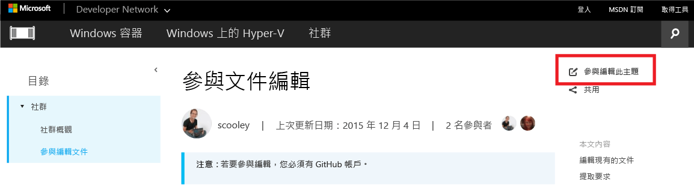
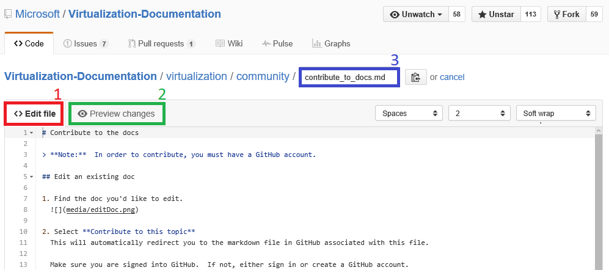
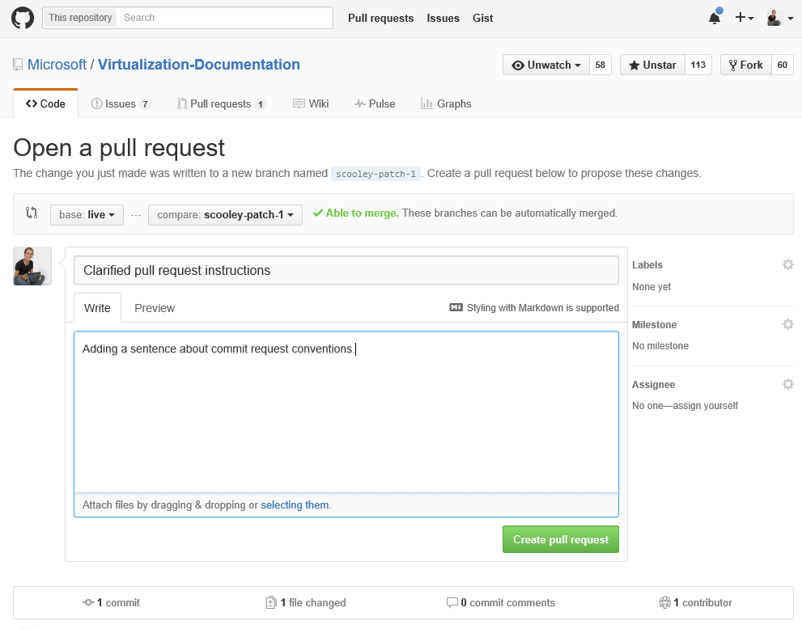
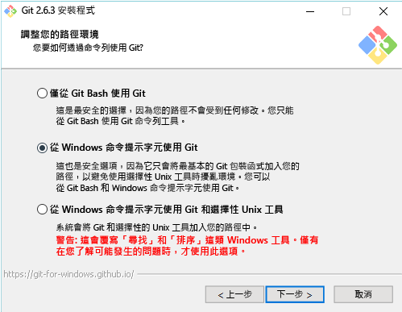

# <a name="contribute-to-the-docs"></a>參與文件編輯

> **注意：** 若要參與編輯，您必須有 [GitHub](https://www.github.com) 帳戶。

## <a name="edit-an-existing-doc"></a>編輯現有的文件

1. 尋找您想要編輯的文件。  

2. 選取**參與編輯此主題**  
  
  
  這會自動將您重新導向 GitHub 中與此檔案相關聯的 markdown 檔案。
  
  請確定您已登入 GitHub。  如果沒有，請登入，或建立 GitHub 帳戶。
  
  
  
3. 選取 \[編輯\] 圖示，開始在瀏覽器中編輯。
  
  

4. 直接在文件內變更。
  
  可能的動作：
  1. 編輯檔案
  2. 預覽變更
  3. 重新命名檔案 (幾乎不太可能會這樣做)
  
  
  
5. 以提取要求提議您的變更
  
  

6. 檢閱您的變更
  
  **我們在提取要求中檢查的項目**  
  * 變更是正確的 -- 它準確地代表技術
  * 拼字/文法正確無誤
  * 文件中的邏輯位置
    
  

7. 建立[提取要求](contribute-to-docs.md#pull-requests)  

## <a name="pull-requests"></a>提取要求

大部分的變更將透過提取要求來認可。  提取要求是由多位檢閱者檢閱變更集、對目前內容進行變更和提出意見的一種方法。


## <a name="fork-the-repo-and-edit-locally"></a>分支存放庫，並在本機編輯

針對長期文件工作，請本機複製存放庫，並在您的電腦上使用。

下列指南說明如何模擬 Sarah Cooley 的設定。  有許多替代設定也同樣適用。

> **注意：** 其中所有文件工具皆適用於 Linux/OSX。  如果您想要其他指南，歡迎提出需求。

本內容分成三個區段：
* [設定 Git](contribute-to-docs.md#set-up-git)
  * Git 安裝
  * 初始設定
  * 分支文件存放庫
  * 將複本複製到本機電腦
* [初始認證管理](contribute-to-docs.md#validate-and-stash-credentials)
  * 隱藏認證和認證協助程式的相關資訊。
* [設定文件環境](contribute-to-docs.md#set-up-markdown-editing-environment)
  * 安裝 VSCode
  * 適用於 Git 之 VSCode 的一些實用功能逐步解說
  * 進行第一次認可。

### <a name="set-up-git"></a>設定 Git

1. 從[這裡](https://git-for-windows.github.io/)安裝 Git (在 Windows 上)

  您只需要在安裝中變更一個值：

  **調整您的 PATH 環境：** 從 Windows 命令提示字元使用 Git

  

  這可讓您在 PowerShell 主控台/任何 Windows 主控台中使用 Git 命令。

2. 設定您的 Git 身分識別

  開啟 PowerShell 視窗，並執行：

  ``` PowerShell
  git config --global user.name "User Name"
  git config --global user.email username@microsoft.com
  ```

  Git 會使用這些值來標示您的認可。

  > 如果收到下列錯誤，表示 Git 可能未正確安裝，或您需要重新啟動 PowerShell。
    ``` PowerShell
    git : The term 'git' is not recognized as the name of a cmdlet, function, script file, or operable program. Check the spelling of the name, or if a path was included, verify that the path is correct and try again.
    ```

3. 設定您的 Git 環境

   設定認證協助程式，以便只需輸入使用者名稱和密碼一次 (至少在這部電腦上)。
   我使用這個基本 [Windows 認證協助程式](https://github.com/Microsoft/Git-Credential-Manager-for-Windows#download-and-install)

   安裝之後，請執行下列命令以啟用認證協助程式，並設定您的推入行為：
   ```
   git config --global credential.helper manager
   git config --global push.default simple
   ```

   第一次進行 GitHub 驗證時，系統會提示您輸入使用者名稱以及雙因素驗證 (如果您有啟用的話)。
   範例：
   ```
   C:\Users\plang\Source\Repos\Virtualization-Documentation [master]> git pull
   Please enter your GitHub credentials for https://github.com/
   username: plang@microsoft.com
   password:
   authcode (app): 562689
   ```
   如此便會自動產生[個人存取權杖](https://github.com/settings/tokens)以及在 GitHub 的適當權限，然後安全地將該權杖儲存在本機電腦上。 未來，系統應該不會再向您提示。

4. 分支存放庫

5. 複製存放庫

  Git 複製會使用適當的勾點來製作 Git 存放庫的本機複本，以同步處理相同存放庫的其他複製。

  根據預設，複製會建立與目前目錄中的存放庫名稱相同的資料夾。  我將所有 Git 存放庫存放在我的使用者目錄中。  請參閱[這裡](http://git-scm.com/docs/git-clone)以深入了解 Git Clone。

  ``` PowerShell
  cd ~
  git clone https://github.com/Microsoft/Virtualization-Documentation.git
  ```

  如果成功，您現在應具備 `Virtualization-Documentation` 資料夾。

  ``` PowerShell
  cd Virtualization-Documentation
  ```

5. \[選用\] 設定 Posh-Git

  Posh-Git 是一種由社群建立的 PowerShell 模組，其可讓您更輕鬆地在 PowerShell 中使用 Git。  它在 PowerShell 中加入 Git 的 TAB 鍵自動完成，也可讓您的提示顯示實用的分支和檔案狀態相關資訊。  如需詳細資訊，請參閱[這裡](https://github.com/dahlbyk/posh-git)。  您可以在系統管理員 PowerShell 主控台中執行下列命令，以安裝 Posh-Git。

  ``` PowerShell
  Install-Module -Name posh-git
  ```

  若要在每次啟動 PowerShell 時讓 Posh-Git 自動運作，請將下列程式碼加入您的 PowerShell 設定檔 (例如 `%UserProfile%\My Documents\WindowsPowerShell\profile.ps1 `)

  ``` PowerShell
  Import-Module posh-git

  function global:prompt {
    $realLASTEXITCODE = $LASTEXITCODE

    Write-Host($pwd.ProviderPath) -nonewline

    Write-VcsStatus

    $global:LASTEXITCODE = $realLASTEXITCODE
    return "> "
  }
  ```

### <a name="validate-and-stash-credentials"></a>驗證和隱藏認證

  若要驗證存放庫是否正確設定，請嘗試提取新的內容。

  ``` PowerShell
  git pull
  ```


### <a name="set-up-markdown-editing-environment"></a>設定 Markdown 編輯環境

1. 下載 VSCode

6. 進行測試認可。  如果您的認證可正確地隱藏，則應該一切運作正常。


