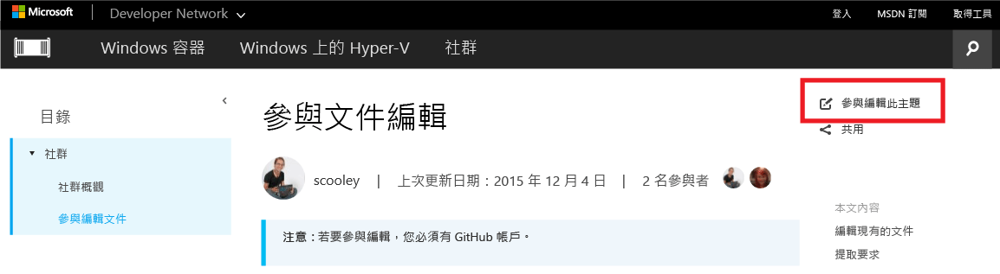

# 參與文件編輯

> **附註：**若要參與編輯，您必須有 [GitHub](https://www.github.com) 帳戶。

## 編輯現有的文件

1. 尋找您想要編輯的文件。

2. 選取**參與編輯此主題**  
    

    這會自動將您重新導向 GitHub 中與此檔案相關聯的 markdown 檔案。

    請確定您已登入 GitHub。 如果沒有，請登入，或建立 GitHub 帳戶。

    

3. 選取 [編輯] 圖示，開始在瀏覽器中編輯。

    

4. 直接在文件內變更。

    可能的動作：
    1. 編輯檔案
    2. 預覽變更
    3. 重新命名檔案 (幾乎不太可能會這樣做)

    

5. 以提取要求提議您的變更

    

6. 檢閱您的變更

    **我們在提取要求中檢查的項目**
    * 變更是正確的 - 它確實代表技術
    * 拼字/文法正確無誤
    * 文件中的邏輯位置

    

7. 建立[提取要求](contribute_to_docs.md#pull-requests)

## 提取要求

大部分的變更將透過提取要求來認可。 提取要求是由多位檢閱者檢閱變更集、對目前內容進行變更和提出意見的一種方法。

