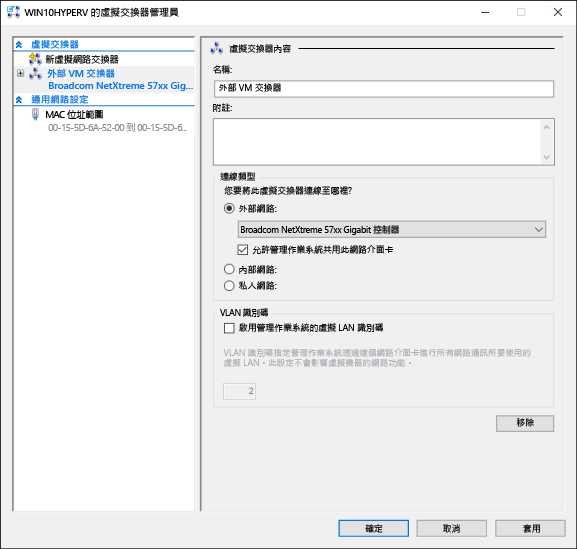
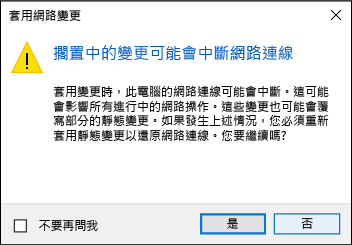

# <a name="create-a-virtual-network"></a>建立虛擬網路

您的虛擬機器需要有虛擬網路才能與您的電腦共用網路。  建立虛擬網路是選擇性的步驟。如果您的虛擬機器不需要連線到網際網路或任何網路，請直接跳至[建立 Windows 虛擬機器](create-virtual-machine.md)。


## <a name="connect-virtual-machines-to-the-internet"></a>將虛擬機器連線到網際網路

Hyper-V 的虛擬交換器類型有三種：外部、內部及私人。 建立外部交換器，以與在其上執行的虛擬機器共用電腦的網路。

這個練習逐步解說如何建立外部虛擬交換器。 完成之後，您的 Hyper-V 主機便會有一部虛擬交換器，可透過電腦的網路連線將虛擬機器連線到網際網路。 

### <a name="create-a-virtual-switch-with-hyper-v-manager"></a>使用 Hyper-V 管理員建立虛擬交換器

1. 開啟 \[Hyper-V 管理員\]。  執行此作業的快速方法是按下 Windows 鍵然後輸入「Hyper-V 管理員」。  
如果搜尋後找不到 \[Hyper-V 管理員\]，即表示並未啟用 Hyper-V 或 Hyper-V 管理工具。  請依照指示[啟用 Hyper-V](enable-hyper-v.md)。

2. 選取左方窗格中的伺服器，或按一下右窗格的 \[連線至伺服器\]。

3. 在 \[Hyper-V 管理員\] 中，從右側的 \[動作\] 功能表選取 **\[虛擬交換器管理員\]** 。 

4. 在 \[虛擬交換器\] 區段底下，選取 **\[新虛擬網路交換器\]** 。

5. 在 \[您要建立哪種類型的虛擬交換器?\] 底下，選取 **\[外部\]** 。

6. 選取 [建立虛擬交換器] 按鈕。

7. 在 \[虛擬交換器內容\] 底下，指定新交換器的名稱，例如 **External VM Switch**。

8. 在 \[連線類型\] 底下，確定已選取 **\[外部網路\]** 。

9. 選取要搭配新虛擬交換器的實體網路卡。 這是實際連線到網路的網路卡。  

    

10. 選取 **\[套用\]** 建立虛擬交換器。 此時，您會看到下列訊息。 按一下 **\[是\]** 繼續作業。

      

11. 選取 **\[確定\]** ，關閉 \[虛擬交換器管理員\] 視窗。


### <a name="create-a-virtual-switch-with-powershell"></a>使用 PowerShell 建立虛擬交換器

使用下列步驟可以 PowerShell 建立外部連線類型的虛擬交換器。 

1. 使用 **Get-NetAdapter** 傳回連線到 Windows 10 系統的網路介面卡清單。

    ```powershell
    PS C:\> Get-NetAdapter

    Name                      InterfaceDescription                    ifIndex Status       MacAddress             LinkSpeed
    ----                      --------------------                    ------- ------       ----------             ---------
    Ethernet 2                Broadcom NetXtreme 57xx Gigabit Cont...       5 Up           BC-30-5B-A8-C1-7F         1 Gbps
    Ethernet                  Intel(R) PRO/100 M Desktop Adapter            3 Up           00-0E-0C-A8-DC-31        10 Mbps  
    ```

2. 選取要與 Hyper-V 交換器搭配的網路介面卡，並在名為 **$net** 的變數中放個執行個體。

    ```powershell
    $net = Get-NetAdapter -Name 'Ethernet'
    ```

3. 執行下列命令以建立新的 Hyper-V 虛擬交換器。

    ```powershell
    New-VMSwitch -Name "External VM Switch" -AllowManagementOS $True -NetAdapterName $net.Name
    ```

## <a name="virtual-networking-on-a-laptop"></a>膝上型電腦的虛擬網路功能

### <a name="nat-networking"></a>NAT 網路功能
網路位址轉譯 (NAT) 透過 Hyper-V 內部虛擬交換器將主機電腦的 IP 位址與連接埠結合，讓虛擬機器存取電腦的網路。

若干實用的屬性如下︰
1. NAT 藉由將外部 IP 位址與連接埠對應至一組更大範圍的內部 IP 位址以節省 IP 位址。 
2. NAT 藉由將通訊連接埠對應至唯一外部連接埠，讓多部虛擬機器可裝載需要相同 (內部) 通訊連接埠的應用程式。
3. NAT 是使用內部交換器，而建立內部交換器並不會影響您使用網路連線，對電腦網路功能的干擾通常較小。

若要設定 NAT 網路並將其連線至虛擬機器，請遵循 [NAT 網路功能使用者指南](../user-guide/setup-nat-network.md)。

### <a name="the-two-switch-approach"></a>兩種方式切換

如果您是在膝上型電腦上執行 Windows 10 Hyper-v，而且經常在無線網路和有線網路之間切換，您可能會想要同時為 ethernet 和無線網路卡建立虛擬交換器。  視膝上型電腦連線到網路的方式而定，您可以在這些交換器之間變更您的虛擬機器。 虛擬機器不會自動在有線和無線之間切換。 

>[!IMPORTANT]
>這兩個切換方法不支援透過無線卡的外部 vSwitch，而且僅供測試之用。

## <a name="next-step---create-a-virtual-machine"></a>後續步驟 - 建立虛擬機器
[建立 Windows 虛擬機器](create-virtual-machine.md)
