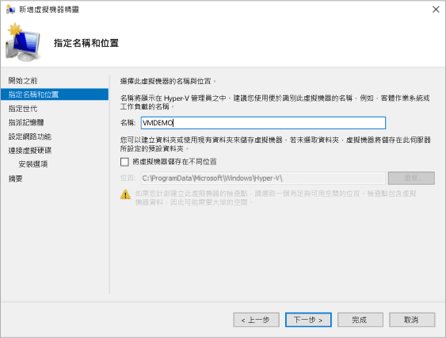
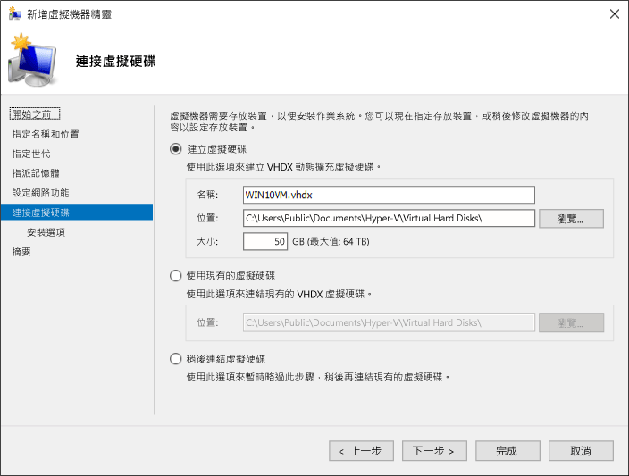

# <a name="create-virtual-machine-with-hyper-v-on-windows-10"></a>在 Windows 10 上使用 Hyper-V 建立虛擬機器

了解如何建立虛擬機器，並且在新的虛擬機器上安裝作業系統。  您需要所要執行之作業系統的 .iso 檔案。 如有需要，可從 [TechNet Evaluation Center](http://www.microsoft.com/evalcenter/) 取得評估版的 Windows 10。

## <a name="create-a-virtual-machine-with-hyper-v-manager"></a>使用 Hyper-V 管理員建立虛擬機器

1. 若要開啟 Hyper-V 管理員，您可以按 Windows 鍵，然後輸入「Hyper-V 管理員」，或是在應用程式中尋找 **\[Hyper-V 管理員\]** 。

1. 在 Hyper-V 管理員中，按一下 **\[動作\]**  >  **\[新增\]**  >  **\[虛擬機器\]** ，即可啟動 \[新增虛擬機器精靈\]。

1. 檢閱 \[在您開始前\] 的內容，然後按一下 **\[下一步\]** 。

1. 為虛擬機器命名。
  > **注意︰** 這是 Hyper-V 用於虛擬機器的名稱，而不是指定給要在虛擬機器內部署之客體作業系統的電腦名稱。

1. 選擇要儲存虛擬機器檔案的位置，例如 **c:\virtualmachine**。 您也可以使用預設位置。 完成時按 **[下一步]** 。

  

1. 選取機器的世代，然後按 **[下一步]** 。  

  Windows Server 2012 R2 引進第 2 代虛擬機器，可提供簡化的虛擬硬體模型和一些額外的功能。 64 位元作業系統只能安裝在第 2 代虛擬機器上。 如需第 2 代虛擬機器的詳細資訊，請參閱[第 2 代虛擬機器概觀](<https://docs.microsoft.com/previous-versions/windows/it-pro/windows-server-2012-R2-and-2012/dn282285(v=ws.11)>)。
  
  > 如果新的虛擬機器設定為第 2 代，並將執行 Linux 散發套件，則必須停用安全開機。 如需安全開機的詳細資訊，請參閱 [Secure Boot](<https://docs.microsoft.com/previous-versions/windows/it-pro/windows-8.1-and-8/dn486875(v=ws.11)>) (安全開機)。

2. 選取 **2048** MB 做為 **\[啟動記憶體\]** 的值，並維持選取 **\[Use Dynamic Memory\] (使用動態記憶體)** 。 按 **[下一步]** 按鈕。

  Hyper-V 主機與在主機上執行的虛擬機器之間會共用記憶體。 可以在單一主機上執行的虛擬機器數目，有一部分取決於可用的記憶體。 也可以將虛擬機器設定為使用動態記憶體。 若啟用，動態記憶體會從執行中的虛擬機器回收未使用的記憶體。 這可讓更多個虛擬機器在主機上執行。 如需動態記憶體的詳細資訊，請參閱 [Hyper-V 動態記憶體概觀](https://docs.microsoft.com/previous-versions/windows/it-pro/windows-server-2012-R2-and-2012/hh831766(v=ws.11))。

3. 在 \[設定網路功能精靈\] 中，選取虛擬機器的虛擬交換器，然後按一下 **\[下一步\]** 。 如需詳細資訊，請參閱[建立虛擬交換器](connect-to-network.md)。

4. 指定虛擬硬碟的名稱，選取位置或保留預設值，最後，指定大小。 一切就緒後，按一下 **\[下一步\]** 。

  虛擬硬碟提供給虛擬機器的儲存體，類似於實體硬碟。 需有虛擬硬碟，才能在虛擬機器上安裝作業系統。
  
  

1. 在 \[安裝選項精靈\] 中，選取 **\[從可開機映像檔安裝作業系統\]** ，然後選取作業系統 .iso 檔。 完成之後，按一下 **\[下一步\]** 。

  建立虛擬機器時，您可以設定某些作業系統安裝選項。 三個選項如下：

  * **稍後安裝作業系統** – 此選項對虛擬機器不會做任何其他修改。

  * **從可開機映像檔安裝作業系統** – 這類似於將 CD 插入實體電腦的實體 CD-ROM 光碟機。 若要設定此選項，請選取 .iso 映像。 此映像將會掛接到虛擬機器的虛擬 CD-ROM 光碟機。 虛擬機器的開機順序會變更為先從 CD-ROM 光碟機開機。

  * **從網路安裝伺服器安裝作業系統** – 除非您已將虛擬機器連接至網路交換器，否則無法使用此選項。 在此設定中，虛擬機器會嘗試從網路開機。

1. 檢閱虛擬機器詳細資料，然後按一下 **\[完成\]** ，完成虛擬機器的建立。

## <a name="create-a-virtual-machine-with-powershell"></a>使用 PowerShell 建立虛擬機器

1. 以系統管理員身分開啟 PowerShell ISE。

2. 執行下列指令碼。

  ``` powershell
  # Set VM Name, Switch Name, and Installation Media Path.
  $VMName = 'TESTVM'
  $Switch = 'External VM Switch'
  $InstallMedia = 'C:\Users\Administrator\Desktop\en_windows_10_enterprise_x64_dvd_6851151.iso'

  # Create New Virtual Machine
  New-VM -Name $VMName -MemoryStartupBytes 2147483648 -Generation 2 -NewVHDPath "D:\Virtual Machines\$VMName\$VMName.vhdx" -NewVHDSizeBytes 53687091200 -Path "D:\Virtual Machines\$VMName" -SwitchName $Switch

  # Add DVD Drive to Virtual Machine
  Add-VMScsiController -VMName $VMName
  Add-VMDvdDrive -VMName $VMName -ControllerNumber 1 -ControllerLocation 0 -Path $InstallMedia

  # Mount Installation Media
  $DVDDrive = Get-VMDvdDrive -VMName $VMName

  # Configure Virtual Machine to Boot from DVD
  Set-VMFirmware -VMName $VMName -FirstBootDevice $DVDDrive
  ```

## <a name="complete-the-operating-system-deployment"></a>完成作業系統部署

若要完成虛擬機器的建置，您必須啟動虛擬機器，然後逐步完成作業系統安裝。

1. 在 \[Hyper-V 管理員\] 中，按兩下該虛擬機器。 這會啟動 VMConnect 工具。

2. 在 VMConnect 中，按一下綠色的 \[開始\] 按鈕。 這就相當於按下實體電腦上的電源按鈕。 系統可能會提示您「按任意鍵從 CD 或 DVD 光碟開機」。 請按照提示執行這項操作。

  > **注意︰** 您可能需要在 VMConnect 視窗內按一下，以確保您的按鍵輸入會傳送至虛擬機器。

3. 虛擬機器會開機進入安裝程式，然後您可以逐步完成安裝，就像在實體電腦上的做法一樣。

   

  > **注意︰** 除非您是執行大量授權版本的 Windows，否則在虛擬機器內執行的 Windows 需要個別授權。 虛擬機器的作業系統與主機作業系統無關。
