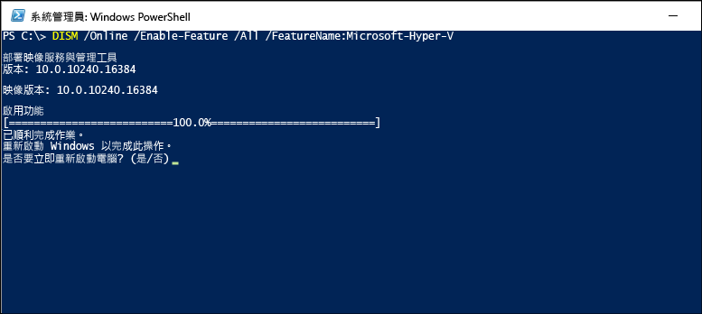
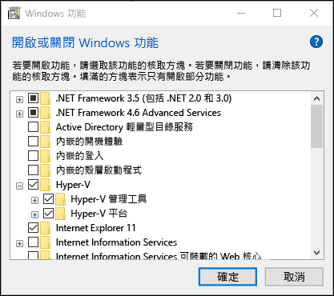

# <a name="install-hyper-v-on-windows-10"></a>在 Windows 10 上安裝 Hyper-V

在 Windows 10 上啟用 Hyper-V，以建立虛擬機器。  
啟用 Hyper-V 的方法有很多種，包括使用 Windows 10 控制台、PowerShell (我最愛的方式)，或是使用部署映像服務與管理工具 (DISM)。 本文件會逐步解說每一種選項。

> **注意︰** Hyper-V 是 Windows 內建的選用功能，並未提供 Hyper-V 下載。

## <a name="check-requirements"></a>檢查需求

* Windows 10 企業版、專業版或教育版
* 使用第二層位址轉譯 (SLAT) 的 64 位元處理器。
* CPU 對 VM 監視模式延伸模組的支援 (Intel CPU 上的 VT-c)。
* 至少 4 GB 記憶體。

Hyper-V 角色**無法**安裝於 Windows 10 家用版。

請開啟 **\[設定\]** > **\[更新與安全性\]** > **\[啟用\]**，將 Windows 10 家用版升級為 Windows 10 專業版。

如需詳細資訊及疑難排解資訊，請參閱 [Windows 10 Hyper-V 系統需求](../reference/hyper-v-requirements.md)。

## <a name="enable-hyper-v-using-powershell"></a>使用 PowerShell 啟用 Hyper-V

1. 以系統管理員身分開啟 PowerShell 主控台。

2. 執行下列命令：

  ```powershell
  Enable-WindowsOptionalFeature -Online -FeatureName Microsoft-Hyper-V -All
  ```

  如果找不到此命令，請確定您是以系統管理員身分執行 PowerShell。

安裝完成時，請重新開機。

## <a name="enable-hyper-v-with-cmd-and-dism"></a>使用 CMD 和 DISM 啟用 Hyper-V

部署映像服務與管理工具 (DISM) 可協助您設定 Windows 和 Windows 映像。  DISM 有許多方面的應用，其中一項即是可於作業系統正在執行時啟用 Windows 功能。

使用 DISM 啟用 Hyper-V 角色：

1. 以系統管理員身分開啟 PowerShell 或 CMD 工作階段。

1. 輸入下列命令：

  ```powershell
  DISM /Online /Enable-Feature /All /FeatureName:Microsoft-Hyper-V
  ```

  

如需 DISM 的詳細資訊，請參閱 [DISM - 部署映像服務與管理技術參考](https://technet.microsoft.com/en-us/library/hh824821.aspx)。

## <a name="enable-the-hyper-v-role-through-settings"></a>透過設定啟用 Hyper-V 角色

1. 以滑鼠右鍵按一下 Windows 鍵，然後選取 \[應用程式與功能\]。

2. 選取 **\[開啟或關閉 Windows 功能\]**。

3. 選取 **\[Hyper-V\]**，然後按一下 **\[確定\]**。



安裝完成後，系統會提示您重新開機電腦。

## <a name="make-virtual-machines"></a>建立虛擬機器

[建立您的第一部虛擬機器](quick-create-virtual-machine.md)
