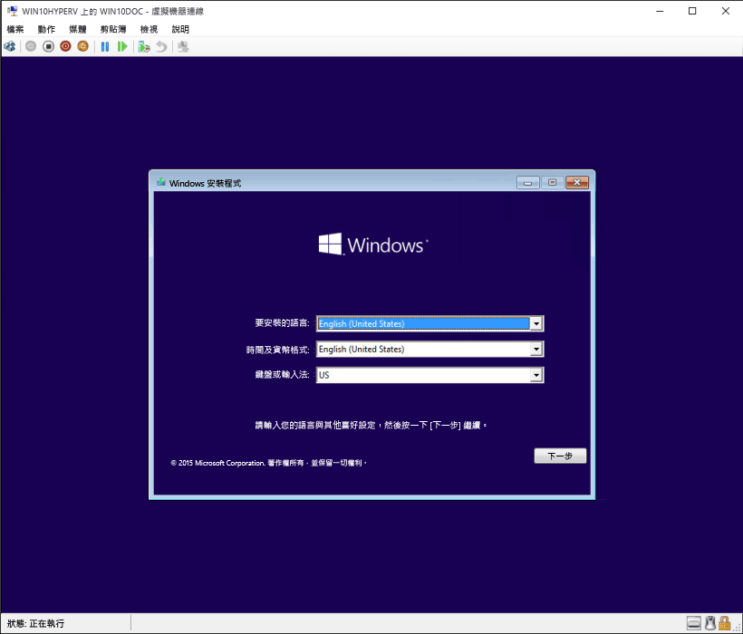

# 使用 Hyper-V 建立虛擬機器

建立虛擬機器，並安裝其作業系統。

我們已建立新的工具來建立虛擬機器, 讓指示在過去三個發行版本本中會有明顯的變更。

請選擇您的作業系統以獲得正確的指示集：

* [Windows 10 秋季創意更新 (v1709) 及更新版本](quick-create-virtual-machine.md#windows-10-fall-creators-update-windows-10-version-1709)
* [Windows 10 創意者更新 (v1703)](quick-create-virtual-machine.md#windows-10-creators-update-windows-10-version-1703)
* [Windows 10 周年紀念更新 (v1607) 及更舊版本](quick-create-virtual-machine.md#before-windows-10-creators-update-windows-10-version-1607-and-earlier)

那就開始吧。

## Windows 10 秋季版創意者更新 (Windows 10 版本 1709)

在 Fall Creators Update 中，[快速建立] 已擴充為包含虛擬機器資源庫，可從 Hyper-V 管理員獨立啟動。

若要在 Fall Creators Update 中建立新的虛擬機器：

1. 從 [開始] 功能表開啟 Hyper-V 快速建立。

    ![Windows [開始] 功能表中的快速建立資源庫](media/quick-create-start-menu.png)

1. 選取作業系統或使用本機安裝來源來選擇您自己的項目。

    

    1. 如果您想使用您自己的映像來建立虛擬機器，請選取 **\[本機安裝來源\]**。
    1. 選取 **\[變更安裝來源\]**。
      
    1. 選擇您想要轉換成新虛擬機器的 .iso 或 .vhdx。
    1. 如果映像是 Linux 映像，請取消選取 \[安全開機\] 選項。
      

1. 選取 \[建立虛擬機器\]

這樣就完成了！  快速建立會打點好剩下的事情。

## Windows 10 創意者更新 (Windows 10 版本 1703)

1. 從 [開始] 功能表開啟 Hyper-V 管理員。

1. 在 Hyper-V 管理員右邊的 **\[動作\]** 功能表中尋找 **\[快速建立\]**。

1. 自訂您的虛擬機器。

    * (選用) 為虛擬機器命名。
    * 選取虛擬機器的安裝媒體。 您可以從 .iso 或 .vhdx 檔案來安裝。
    如果您是在虛擬機器中安裝 Windows，則可啟用 \[Windows 安全開機\]。 否則，請保持不選取。
    * 設定網路。
    如果您有現存的虛擬交換器，可以在 \[網路\] 下拉式清單中選取。 如果沒有現存的交換器，您會看到用來設定自動網路的按鈕，可自動設定虛擬網路。

1. 按一下 **\[連接\]** 啟動您的虛擬機器。 不用擔心是否要編輯設定，您隨時都可以回來變更設定。

    系統可能會提示您「按任意鍵從 CD 或 DVD 光碟開機」。 請按照提示執行這項操作。  據它所知，您是要從 CD 安裝。

恭喜您，您有了新的虛擬機器。  現在您可以準備安裝作業系統。

您的虛擬機器看起來應該像這樣︰

> **注意︰** 除非您是執行大量授權版本的 Windows，否則在虛擬機器內執行的 Windows 需要個別授權。 虛擬機器的作業系統與主機作業系統無關。

## 在 Windows 10 創意者更新之前 (Windows 10 版本1607及更舊版本)

如果您不是執行 Windows 10 Creators Update 或更新版本，請遵循下列指示，改用 \[新增虛擬機器精靈\]：

1. [建立虛擬網路](connect-to-network.md)
1. [建立新的虛擬機器](create-virtual-machine.md)
