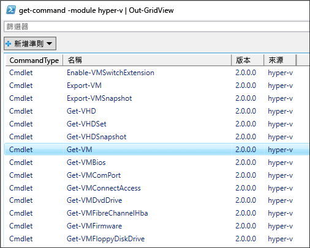
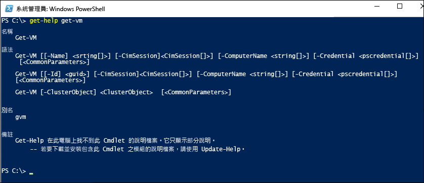
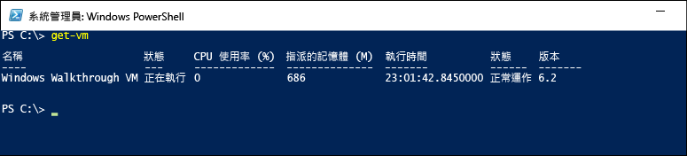

# <a name="working-with-hyper-v-and-windows-powershell"></a>使用 Hyper-V 與 Windows PowerShell

您已經逐步進行部署 Hyper-V、建立虛擬機器、管理這些虛擬機器的基本作業，現在，讓我們來探索如何使用 PowerShell 將這許多活動自動化。

### <a name="return-a-list-of-hyper-v-commands"></a>傳回 Hyper-V 命令清單

1. 按一下 Windows [開始] 按鈕，輸入 **PowerShell**。
2. 執行下列命令，以顯示搜尋到的 Hyper-V PowerShell 模組可用 PowerShell 命令清單。

 ```powershell
Get-Command -Module hyper-v | Out-GridView
```
  結果類似這樣：

  

3. 如需深入了解特定的 PowerShell 命令，請使用 `Get-Help`。 例如執行下列命令會傳回 `Get-VM` Hyper-V 命令的資訊。

  ```powershell
  Get-Help Get-VM
  ```
 輸出會顯示如何建構命令、有哪些必要和選擇性參數、以及您可以使用的別名。

 


### <a name="return-a-list-of-virtual-machines"></a>傳回虛擬機器清單

使用 `Get-VM` 命令傳回虛擬機器的清單。

1. 在 PowerShell 中執行下列命令：
 
 ```powershell
 Get-VM
 ```
 結果類似這樣：

 

2. 若只要傳回已開機的虛擬機器清單，請在 `Get-VM` 命令中新增篩選。 您可以使用 `Where-Object` 命令新增篩選。 如需篩選的詳細資訊，請參閱[使用 Where-Object](<https://docs.microsoft.com/previous-versions/windows/it-pro/windows-powershell-1.0/ee177028(v=technet.10)>) 文件。

 ```powershell
 Get-VM | where {$_.State -eq 'Running'}
 ```
3.  若要列出所有電源關閉狀態的虛擬機器清單，執行下列命令。 此命令與步驟 2 中的命令相同，只是將篩選從 'Running' 變更為 'Off'。

 ```powershell
 Get-VM | where {$_.State -eq 'Off'}
 ```

### <a name="start-and-shut-down-virtual-machines"></a>啟動和關閉虛擬機器

1. 若要啟動特定虛擬機器，請用虛擬機器的名稱執行下列命令：

 ```powershell
 Start-VM -Name <virtual machine name>
 ```

2. 若要啟動目前為關機的所有虛擬機器，請先取得這些機器的清單，然後使用管線將此清單傳送給 `Start-VM` 命令：

  ```powershell
  Get-VM | where {$_.State -eq 'Off'} | Start-VM
  ```
3. 若要關閉所有執行中的虛擬機器，執行此命令：
 
  ```powershell
  Get-VM | where {$_.State -eq 'Running'} | Stop-VM
  ```

### <a name="create-a-vm-checkpoint"></a>建立 VM 檢查點

若要使用 PowerShell 建立檢查點，請使用 `Get-VM` 命令選取虛擬機器，然後使用管道將結果傳送給 `Checkpoint-VM` 命令。 最後使用 `-SnapshotName` 為檢查點命名。 完整的命令看起來像這樣：

 ```powershell
 Get-VM -Name <VM Name> | Checkpoint-VM -SnapshotName <name for snapshot>
 ```
### <a name="create-a-new-virtual-machine"></a>建立新的虛擬機器

下列範例示範如何在 PowerShell 整合式指令碼環境 (ISE) 中建立新的虛擬機器。 這是一個簡單的範例，可以再擴大包，含其他 PowerShell 功能和更進階的 VM 部署。

1. 若要開啟 PowerShell ISE，請按一下 [開始]，輸入 **PowerShell ISE**。
2. 執行下列程式碼建立虛擬機器。 如需 `New-VM` 命令的詳細資訊，請參閱 [New-VM](https://docs.microsoft.com/powershell/module/hyper-v/new-vm?view=win10-ps) 文件。

 ```powershell
  $VMName = "VMNAME"

  $VM = @{
      Name = $VMName
      MemoryStartupBytes = 2147483648
      Generation = 2
      NewVHDPath = "C:\Virtual Machines\$VMName\$VMName.vhdx"
      NewVHDSizeBytes = 53687091200
      BootDevice = "VHD"
      Path = "C:\Virtual Machines\$VMName"
      SwitchName = (Get-VMSwitch).Name
  }

  New-VM @VM
 ```

## <a name="wrap-up-and-references"></a>結語與參考資料

本文件示範了一些簡單的步驟，來介紹 Hyper-V PowerShell 模組以及一些範例案例。 如需 Hyper-V PowerShell 模組的詳細資訊，請參閱 [Windows PowerShell 中 Hyper-V Cmdlet 參考資料](https://docs.microsoft.com/powershell/module/hyper-v/index?view=win10-ps)。  
 
