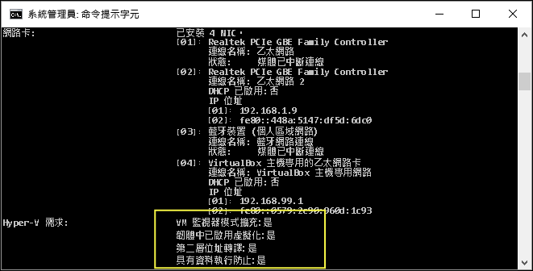

# <a name="windows-10-hyper-v-system-requirements"></a>Windows 10 Hyoer-V 系統需求

Hyper-v 可在64位版本的 Windows 10 專業版、企業版和教育版中使用。 Hyper-V 需要第二層位址轉譯 (SLAT) -- Intel 和 AMD 當前推出的 64 位元處理器所具備的一項功能。

您可以在具有 4GB RAM 的主機上執行 3 或 4 部基本虛擬機器，但更多虛擬機器會需要更多資源。 反之，您也可以建立具有 32 個處理器和 512GB RAM 的大型虛擬機器，視您的實體硬體而定。

## <a name="operating-system-requirements"></a>作業系統需求

在這些版本的 Windows 10 上可啟用 Hyper-V 角色：

- Windows 10 企業版
- Windows 10 專業版
- Windows 10 教育版

Hyper-V 角色**無法**安裝在：

- Windows 10 Home
- Windows 10 行動裝置版
- Windows 10 Mobile Enterprise

>Windows 10 Home edition 可以升級至 Windows 10 專業版。 若要這麼做，請開啟 **\[設定\]**  >  **\[更新和安全性\]**  >  **\[啟用\]** 。 您可以在此瀏覽市集並購買升級。

## <a name="hardware-requirements"></a>硬體需求

這份文件未提供與 Hyper-V 相容硬體的完整清單，但下列為必要項目：

- 使用第二層位址轉譯 (SLAT) 的 64 位元處理器。
- VM 監視器模式擴充功能的 CPU 支援（Intel CPU 上的 VT-x）。
- 至少 4 GB 記憶體。 因為虛擬機器與 Hyper-V 主機共用記憶體，所以您必須提供足夠的記憶體來處理預期的虛擬工作負載。

在系統 BIOS 中必須啟用下列項目：
- 虛擬化技術 - 可能有不同的項目名稱，視主機板製造商而定。
- 硬體強制的資料執行防止。

## <a name="verify-hardware-compatibility"></a>確認硬體相容性

若要確認相容性，請開啟 PowerShell 或命令提示字元 (cmd.exe)，然後輸入 **systeminfo**。 如果所有列出的 Hyper-V 需求的值皆為[Yes]，則您的系統可執行 Hyper-V 角色。 如有任何項目傳回 **[否]** ，請檢閱這份文件中列出的需求，並盡可能調整。



如果您在現有 Hyper-V 主機上執行 **systeminfo**，\[Hyper-V 需求\] 區段會顯示：

```
Hyper-V Requirements: A hypervisor has been detected. Features required for Hyper-V will not be displayed.
```
