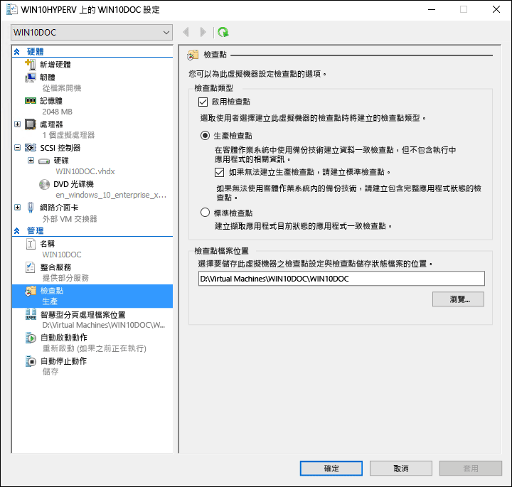
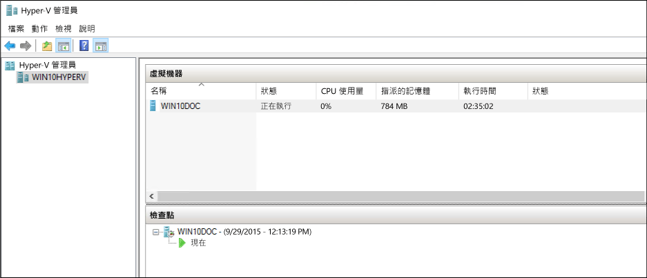
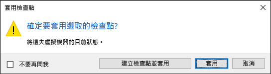

# <a name="using-checkpoints-to-revert-virtual-machines-to-a-previous-state"></a>使用檢查點將虛擬機器還原為先前的狀態

虛擬化的好處之一是能夠輕易地儲存虛擬機器的狀態。 在 Hyper-V 中，透過使用虛擬機器檢查點即可做到這一點。 您可能會想在進行軟體設定變更、套用軟體更新或安裝新軟體之前，建立虛擬機器檢查點。 如果系統變更造成問題，可以將虛擬機器還原到採取檢查點時的狀態。

Windows 10 Hyper-V 有兩種類型的檢查點：

* **標準檢查點**：在起始檢查點時，取得虛擬機器和虛擬機器記憶體狀態的快照集。 快照不是完整備份，而且可能導致在不同節點 (例如 Active Directory) 之間複寫資料的系統發生不一致問題。  Hyper-V 只在 Windows 10 之前提供標準檢查點 (以前稱為快照)。

* **生產檢查點**：在 Linux 虛擬機器上使用磁碟區陰影複製服務或檔案系統凍結，以建立虛擬機器的資料一致備份。 系統並不會建立虛擬機器記憶體狀態的任何快照。

預設會選取生產檢查點，不過這可使用 Hyper-V 管理員或 PowerShell 加以變更。

> **附註：** Hyper-V PowerShell 模組中有數個別名，讓檢查點和快照可以交換使用。  
  本文件使用檢查點，不過請注意，使用字詞快照時您可能會看到類似的命令。

## <a name="changing-the-checkpoint-type"></a>變更檢查點類型

**使用 Hyper-V 管理員**

1. 開啟 \[Hyper-V 管理員\]。
2. 在虛擬機器上按一下滑鼠右鍵，並選取 **[設定]** 。
3. 在 \[管理\] 下選取 **\[檢查點\]** 。
4. 選取所需的檢查點類型。

<br />



**使用 PowerShell**

使用 PowerShell 可以執行下列命令變更檢查點。 

設定為標準檢查點：
```powershell
Set-VM -Name <vmname> -CheckpointType Standard
```

設定為生產檢查點，如果生產檢查點失敗，則建立標準檢查點：
```powershell
Set-VM -Name <vmname> -CheckpointType Production
```

設定為生產檢查點，如果生產檢查點失敗，不會建立標準檢查點。 
```powershell
Set-VM -Name <vmname> -CheckpointType ProductionOnly
```

## <a name="creating-checkpoints"></a>建立檢查點

建立虛擬機器設定之類型的檢查點。 有關如何變更此類型，請參閱本文件前面的[設定檢查點類型](checkpoints.md#changing-the-checkpoint-type)一節的指示。

**使用 Hyper-V 管理員**

建立檢查點：  
1. 在 \[Hyper-V 管理員\] 中，選取虛擬機器。
2. 以滑鼠右鍵按一下虛擬機器的名稱，然後按一下 **[檢查點]** 。
3. 此程序完成後，檢查點會出現在 **\[Hyper-V 管理員\]** 中的 **\[檢查點\]** 下。

**使用 PowerShell**

使用 **CheckPoint-VM** 命令建立檢查點。  

```powershell
Checkpoint-VM -Name <VMName>
```

當檢查點程序完成時，可使用 **Get-VMCheckpoint** 命令查看虛擬機器的檢查點清單。

```powershell
Get-VMCheckpoint -VMName <VMName>
```

## <a name="applying-checkpoints"></a>套用檢查點

如果您要將虛擬機器還原至先前的時間點，您可以套用現有的檢查點。

**使用 Hyper-V 管理員**

1. 在 **[Hyper-V 管理員]** 中的 **[虛擬機器]** 下，選取虛擬機器。
2. 在 [檢查點] 區段中，以滑鼠右鍵按一下您要使用的檢查點，然後按一下 **[套用]** 。
3. 此時會出現一個對話方塊，內含下列選項：  
  * **建立檢查點再套用**：在虛擬機器套用先前的檢查點之前，先建立新的檢查點。 
  * **套用**：套用您所選擇的檢查點。 您無法復原此動作。
  * **取消**：關閉對話方塊，而不進行任何動作。
  
  選取 \[套用\] 選項來建立並套用檢查點。

**使用 PowerShell**

5. 若要查看虛擬機器的檢查點清單，可使用 **Get-VMCheckpoint** 命令。

    ```powershell
    Get-VMCheckpoint -VMName <VMName>
    ```
6. 若要套用檢查點，可使用 **Restore-VMCheckpoint** 命令。

    ```powershell
    Restore-VMCheckpoint -Name <checkpoint name> -VMName <VMName> -Confirm:$false
    ```

## <a name="renaming-checkpoints"></a>重新命名檢查點

特定點會建立許多檢查點。  為他們提供可識別的名稱，可讓您更容易記住建立檢查點時系統狀態的詳細資料。

根據預設，檢查點的名稱會是虛擬機器的名稱加上建立檢查點的日期和時間。 這是標準格式： 

```
virtual_machine_name (MM/DD/YYY -hh:mm:ss AM\PM)
```

名稱限定為 100 個字元，且名稱不可空白。 

**使用 Hyper-V 管理員**

1. 在 **\[Hyper-V 管理員\]** 中，選取虛擬機器。
2. 以滑鼠右鍵按一下檢查點，然後選取 **[重新命名]** 。
3. 輸入檢查點的新名稱。 此名稱必須少於 100 個字元，且欄位不可空白。
4. 完成後請按一下 **ENTER** 鍵。

**使用 PowerShell**

``` powershell
Rename-VMCheckpoint -VMName <virtual machine name> -Name <checkpoint name> -NewName <new checkpoint name>
```

## <a name="deleting-checkpoints"></a>刪除檢查點

刪除檢查點有助於在 Hyper-V 主機上挪出空間。

在幕後，檢查點會在與 .vhdx 檔案相同的位置中，儲存為虛擬機器的 .avhdx 檔案。 當您刪除檢查點時，Hyper-V 會為您合併 .avhdx 和 .vhdx 檔案。  完成後，將會從檔案系統中刪除檢查點的 .avhdx 檔案。 

您不應該直接刪除.avhdx 檔案。
 
**使用 Hyper-V 管理員**

若要完全刪除檢查點： 

1. 在 **\[Hyper-V 管理員\]** 中，選取虛擬機器。
2. 在 [**檢查點**] 區段中，以滑鼠右鍵按一下您要刪除的檢查點，然後按一下 [刪除]。 您也可以刪除某個檢查點和所有後續的檢查點。 若要這樣做，請以滑鼠右鍵按一下您要刪除的最早檢查點，然後按一下 **\[刪除檢查點樹狀子目錄\]**。
3. 系統可能會要求您確認是否要刪除檢查點。 確認其為正確的檢查點後，按一下 **\[刪除\]** 。 
 
**使用 PowerShell**
```powershell
Remove-VMCheckpoint -VMName <virtual machine name> -Name <checkpoint name>
```

## <a name="exporting-checkpoints"></a>匯出檢查點

匯出會將檢查點包裝成虛擬機器，讓檢查點可以移至新位置。 匯入之後，檢查點會還原為虛擬機器。 匯出的檢查點可用於備份。

**使用 PowerShell**
``` powershell
Export-VMCheckpoint -VMName <virtual machine name> -Name <checkpoint name> -Path <path for export>
```

## <a name="enable-or-disable-checkpoints"></a>啟用或停用檢查點

1. 在 **[Hyper-V 管理員]** 中，以滑鼠右鍵按一下虛擬機器的名稱，然後按一下 **[設定]** 。
2. 在 **[管理]** 區段中，選取 **[檢查點]** 。
3. 若要讓此虛擬機器取消檢查點，請確定已選取 \[啟用檢查點\] - 這是預設行為。  
若要停用檢查點，請取消選取 **\[啟用檢查點\]** 核取方塊。
4. 按一下 **\[套用\]** 以套用變更。 完成之後，請按一下 **\[確定\]** 以關閉對話方塊。

## <a name="configure-checkpoint-location"></a>設定檢查點位置

如果虛擬機器沒有檢查點，您可以變更檢查點設定和儲存狀態檔案的存放位置。

1. 在 **[Hyper-V 管理員]** 中，以滑鼠右鍵按一下虛擬機器的名稱，然後按一下 **[設定]** 。
2. 在 **\[管理\]** 區段中，選取 **\[檢查點\]** 或 **\[檢查點檔案位置\]** 。
4. 在 **\[檢查點檔案位置\]** 中，輸入您要用來儲存檔案的資料夾路徑。
5. 按一下 **\[套用\]** 以套用變更。 完成之後，請按一下 **\[確定\]** 以關閉對話方塊。

儲存檢查點設定檔的預設位置是：`%systemroot%\ProgramData\Microsoft\Windows\Hyper-V\Snapshots`。


<!-- This belongs in dev docs

This folder will contain the .VMRS file with the runtime and saved state data and a .VMCX configuration file, which uses the checkpoint GUID as the file name.
-->

## <a name="checkpoint-demo"></a>檢查點示範

這個練習逐步解說如何建立和套用標準檢查點與生產檢查點。  在此範例中，您將對虛擬機器做簡單的變更，並觀察不同的行為。 

### <a name="standard-checkpoint"></a>標準檢查點

1. 登入您的虛擬機器，並在桌面上建立文字檔。
2. 以 \[記事本\] 開啟此檔案，並輸入文字「這是標準檢查點」。 **不要儲存檔案或關閉記事本**。  
3. 將檢查點變更為標準 -- [這裡](checkpoints.md#changing-the-checkpoint-type)提供指示。
4. 建立新的檢查點。

<br />

 

**以 Hyper-V 管理員套用標準檢查點**

現在，有了檢查點，請修改虛擬機器，然後套用檢查點將虛擬機器還原為儲存時的狀態。 

1. 如果文字檔仍為開啟狀態，請將它關閉，並從虛擬機器的桌面上刪除它。
2. 開啟 \[Hyper-V 管理員\]，以滑鼠右鍵按一下標準檢查點，然後選取 \[套用\]。
3. 選取 \[套用檢查點\] 通知視窗中的 \[套用\]。

<br />

 

套用檢查點後，會發現不只是文字檔案出現了，而且系統處於檢查點建立時完全相同的狀態。 在此範例中，\[記事本\] 會開啟，而且載入文字檔案。

### <a name="production-checkpoint"></a>生產檢查點

現在，來試試生產檢查點。 此處理序幾乎與使用標準檢查點完全相同，不過結果會稍微不同。 開始之前，請確定您備妥虛擬機器，且已將檢查點類型變更為生產檢查點。

**修改虛擬機器並建立生產檢查點**

1. 登入虛擬機器，並在桌面上建立新的文字檔。 如果您已遵循先前的練習，則可以使用現有的文字檔。
2. 在文字檔中輸入「這是生產檢查點」， 儲存文字檔，但**不要關閉 [記事本]** 。
3. 開啟 [Hyper-v 管理員]，以滑鼠右鍵按一下虛擬機器，然後選取 [**檢查點**]。
4. 按一下 [已建立生產檢查點] 視窗中的 **[確定]** 。

<br />

 

**以 Hyper-V 管理員套用生產檢查點**

現在，有了檢查點，請修改系統，然後套用檢查點將虛擬機器還原為儲存時的狀態。 

1. 如果文字檔仍為開啟狀態，請將它關閉，並從虛擬機器的桌面上刪除它。
2. 開啟 [Hyper-v 管理員]，以滑鼠右鍵按一下生產檢查點，然後**選取 [** 套用]。
3. 選取 \[套用檢查點\] 通知視窗中的 **\[套用\]** 。

一旦套用生產檢查點，會發現虛擬機器處於關閉狀態。

1. 啟動並登入虛擬機器。
2. 會看到文字檔案已還原。 但不同於標準檢查點，\[記事本\] 並未開啟。   
