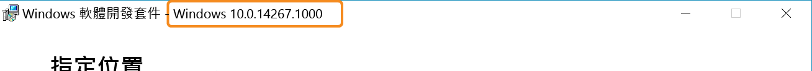

# 製作您自己的整合服務

從 Windows 10 開始，任何人都可以製作與隨附 Hyper-V 整合服務相似的服務，其會使用 Hyper-V 主機和執行於其中之虛擬機器之間的新通訊端型通訊通道。 使用 Hyper-V 通訊端時，服務將可在網路堆疊外獨立執行，且所有資料將會存留在相同的實體記憶體上。

本文將逐步說明如何建立在 Hyper-V 通訊端上建置的簡易應用程式，和如何開始加以使用。

舉例來說，[PowerShell Direct](../user_guide/vmsession.md) 就是使用 Hyper-V 通訊端進行通訊的應用程式 (在此案例中為隨附 Windows 服務)。

**支援的主機 OS**
* Windows 10 組建 14290 及更新版本
* Windows Server Technical Preview 4 及更新版本
* 未來版本 (Server 2016 +)

**支援的客體 OS**
* Windows 10
* Windows Server Technical Preview 4 及更新版本
* 未來版本 (Server 2016 +)
* 使用 Linux 整合服務的 Linux 客體 (請參閱 [Supported Linux and FreeBSD virtual machines for Hyper-V on Windows](https://technet.microsoft.com/library/dn531030(ws.12).aspx)) (Windows 上 Hyper-V 支援的 Linux 及 FreeBSD 虛擬機器)

**功能和限制**
* 支援核心模式或使用者模式動作
* 僅限資料流
* 沒有區塊記憶體 (並非備份/視訊的最佳選擇)

--------------


## 開始使用

現在，Hyper-V 通訊端已可在原生程式碼 (C/C++) 中使用。

若要撰寫簡單的應用程式，您將需要：
* C 編譯器。 如果您沒有，請查看 [Visual Studio 程式碼](https://aka.ms/vs)
* 執行 Hyper-V 與虛擬機器的電腦。
  * 主機和客體 (VM) OS 必須是 Windows 10、Windows Server Technical Preview 3 或更新版本。
* 安裝於 Hyper-V 主機的 [Windows 10 SDK](http://aka.ms/flightingSDK)

**Windows SDK 詳細資料**

通往 Windows SDK 的連結：
* [供測試人員預覽的 Windows 10 SDK](http://aka.ms/flightingSDK)
* [Windows 10 SDK](https://dev.windows.com/en-us/downloads/windows-10-sdk)

適用於 Hyper-V 通訊端的 API 已在 Windows 10 組建 14290 中提供使用；這是正式發行前小眾測試下載，其符合最新測試人員速成正式發行前小眾測試組建。  
若您遇到奇怪的行為，請在 [TechNet 論壇](https://social.technet.microsoft.com/Forums/windowsserver/en-US/home "TechNet 論壇")讓我們知道。 請在您的貼文中加入以下內容：
* 未預期的行為
* 主機、客體及 SDK 的 OS 與組建編號。

  您可以在 SDK 安裝程式標題看到 SDK 組建編號︰  
  


## 註冊新的應用程式

若要使用 Hyper-V 通訊端，必須在 Hyper-V 主機的登錄中註冊應用程式。

在登錄中註冊服務後，您將獲得：
*  可啟用、停用即列出可用服務的 WMI 管理
*  直接與虛擬機器通訊的權限

下列 PowerShell 將會註冊名為 "HV Socket Demo" 的新應用程式。 這必須以系統管理員身分執行。 操作指示如下。

``` PowerShell
$friendlyName = "HV Socket Demo"

# Create a new random GUID and add it to the services list then add the name as a value

$service = New-Item -Path "HKLM:\SOFTWARE\Microsoft\Windows NT\CurrentVersion\Virtualization\GuestCommunicationServices" -Name ((New-Guid).Guid)

$service.SetValue("ElementName", $friendlyName)

# Copy GUID to clipboard for later use
$service.PSChildName | clip.exe
```

** 登錄位置和資訊 **

``` 
HKEY_LOCAL_MACHINE\SOFTWARE\Microsoft\Windows NT\CurrentVersion\Virtualization\GuestCommunicationServices\
```
在此登錄位置中，您會看見數個 GUID。 這是我們的隨附服務。

每個服務的登錄資訊：
* `服務 GUID`
    * `ElementName (REG_SZ)` -- 這是服務的好記名稱

若要註冊您自己的服務，請使用您自己的 GUID 和好記名稱建立新的登錄機碼。

易記名稱將會與您的新應用程式相關聯。 它會出現在效能計數器中，以及其他不適用 GUID 之處。

登錄項目將如下所示：
```
HKEY_LOCAL_MACHINE\SOFTWARE\Microsoft\Windows NT\CurrentVersion\Virtualization\GuestCommunicationServices\
    999E53D4-3D5C-4C3E-8779-BED06EC056E1\
        ElementName REG_SZ  VM Session Service
    YourGUID\
        ElementName REG_SZ  Your Service Friendly Name
```

> ** 提示：** 若要在 PowerShell 中產生 GUID，請將其複製到剪貼簿，執行：
``` PowerShell
(New-Guid).Guid | clip.exe
```

## 建立 Hyper-V 通訊端

在大部分的基本案例中，定義通訊端都需要位址家族、連線類型和通訊協定。

以下是簡單的 [通訊端定義](
https://msdn.microsoft.com/en-us/library/windows/desktop/ms740506(v=vs.85).aspx
)

``` C
SOCKET WSAAPI socket(
  _In_ int af,
  _In_ int type,
  _In_ int protocol
);
```

若是 Hyper-V 通訊端：
* 位址家族 - `AF_HYPERV`
* 類型 - `SOCK_STREAM`
* 通訊協定 - `HV_PROTOCOL_RAW`


以下是範例宣告/實例：
``` C
SOCKET sock = socket(AF_HYPERV, SOCK_STREAM, HV_PROTOCOL_RAW);
```


## 繫結至 Hyper-V 通訊端

繫結可建立通訊端與連線資訊的關聯。

為了方便起見，功能定義複製如下，若想進一步了解繫結，請參閱[這裡](https://msdn.microsoft.com/en-us/library/windows/desktop/ms737550.aspx)。

``` C
int bind(
  _In_ SOCKET                s,
  _In_ const struct sockaddr *name,
  _In_ int                   namelen
);
```

有別於標準網際網路通訊協定位址家族 (`AF_INET`) 的通訊端位址 (sockaddr) 是由主機電腦的 IP 位址和該主機的連接埠號碼所組成，`AF_HYPERV` 的通訊端位址則使用虛擬機器的識別碼和上面定義的應用程式識別碼來建立連線。

由於 Hyper-V 通訊端並未依賴網路堆疊、TCP/IP、DNS 等項目，因此通訊端的端點需要仍可明確說明連線的非 IP (而不是主機名稱) 格式。

以下是 Hyper-V 通訊端的通訊端位址定義：

``` C
struct SOCKADDR_HV
{
     ADDRESS_FAMILY Family;
     USHORT Reserved;
     GUID VmId;
     GUID ServiceId;
};
```

AF_HYPERV 端點並不依賴 IP 或主機名稱，而是高度依賴兩個 GUID：
* VM ID – 這是為每個 VM 指派的唯一 ID。 VM 的 ID 可使用下列 PowerShell 指令碼片段來尋找。
  ```PowerShell
  (Get-VM -Name $VMName).Id
  ```
* 服務 ID – GUID，[如前所述](#RegisterANewApplication)，可供應用程式在 Hyper-V 主機登錄中進行註冊。

此外還有一組在連線到非特定虛擬機器時可使用的 VMID 萬用字元。

### VMID 萬用字元

| 名稱| GUID| 描述|
|:-----|:-----|:-----|
| HV_GUID_ZERO| 00000000-0000-0000-0000-000000000000| 接聽程式應繫結至此 VmId，才可接受來自所有分割區的連線。|
| HV_GUID_WILDCARD| 00000000-0000-0000-0000-000000000000| 接聽程式應繫結至此 VmId，才可接受來自所有分割區的連線。|
| HV_GUID_BROADCAST| FFFFFFFF-FFFF-FFFF-FFFF-FFFFFFFFFFFF| |
| HV_GUID_CHILDREN| 90db8b89-0d35-4f79-8ce9-49ea0ac8b7cd| 子項的萬用字元位址。接聽程式應繫結至此 VmId，才可接受來自其子項的連線。|
| HV_GUID_LOOPBACK| e0e16197-dd56-4a10-9195-5ee7a155a838| 回送位址。使用此 VmId，可連接到與連接器相同的分割區。|
| HV_GUID_PARENT| a42e7cda-d03f-480c-9cc2-a4de20abb878| 父項位址。使用此 VmId，可連接到連接器的父項分割區。*|


***HV_GUID_PARENT**  
虛擬機器的父項是其主機。 容器的父項是容器的主機。  
從執行於虛擬機器中的容器連接，將會連接到主控容器的 VM。  
在此 VmId 上接聽，可接受下列來源的連線：  
(在容器內)：容器主機。  
(在 VM 內：容器主機/無容器)：VM 主機。  
(不在 VM 內：容器主機/無容器)：不支援。

## 支援的通訊端命令

Socket()
Bind()
Connect()
Send()
Listen()
Accept()

[完整 WinSock API](https://msdn.microsoft.com/en-us/library/windows/desktop/ms741394.aspx)

## 進行中的工作

正常中斷連線
選取


<!--HONumber=Mar16_HO4-->


