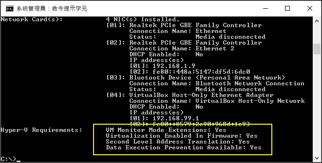

# Windows 10 Hyoer-V 系統需求

Windows 10 上的 Hyper-V 僅能在一組特定的硬體和作業系統設定下運作。 本文件簡要討論 Hyper-V 的軟體和硬體需求，並示範如何檢查系統與 Hyper-V 的相容性。 雖然這份文件不會詳述與 Hyper-V 相容的每個系統設定，使用此處的指南可幫助您快速找出您目前的系統是否可以裝載 Hyper-V 虛擬機器。

## 作業系統需求

在這些版本的 Windows 10 上可啟用 Hyper-V 角色：

- Windows 10 Enterprise
- Windows 10 Professional
- Windows 10 Education

Hyper-V 角色無法安裝在：

- Windows 10 Home
- Windows 10 Mobile
- Windows 10 Mobile Enterprise

> Windows 10 Home 可以升級到 Windows 10 Professional。 若要這麼做，請開啟 **[設定]** > **[更新和安全性]** > **[啟用]**。 您可以在此瀏覽市集並購買升級。

## 硬體需求

這份文件未提供與 Hyper-V 相容硬體的完整清單，但下列為必要項目：

- 使用第二層位址轉譯 (SLAT) 的 64 位元處理器。
- CPU 對 VM 監視模式延伸模組的支援 (Intel CPU 上的 VT-c)。
- 最少 4 GB 記憶體，但是因為虛擬機器與 Hyper-V 主機共用記憶體，您必須提供足夠的記憶體來處理預期的虛擬工作負載。

在系統 bios 中必須啟用下列項目：
- 虛擬化技術 - 可能有不同的項目名稱，視主機板製造商而定。
- 硬體強制的資料執行防止。

## 確認硬體相容性

若要確認相容性，請開啟 PowerShell 或命令提示字元 (cmd.exe)，並輸入 **systeminfo.exe**。 這樣會傳回關於 Hyper-V 相容性的資訊。
如果所有列出的 Hyper-V 需求的值皆為[是]****，則您的系統可執行 Hyper-V 角色。 如有任何項目傳回 **[否]**，請檢閱這份文件中列出的需求，並盡可能調整。



如果您在現有 Hyper-V 主機上執行 **systeminfo.exe**，[Hyper-V 需求] 區段會顯示：

```
Hyper-V Requirements: A hypervisor has been detected. Features required for Hyper-V are not be displayed.
```

## 下一步 - 安裝 Hyper-V

[下一步 - 安裝 Hyper-V](walkthrough_install.md)


