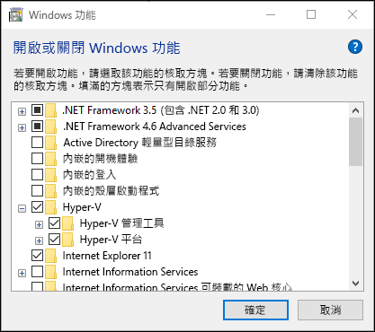
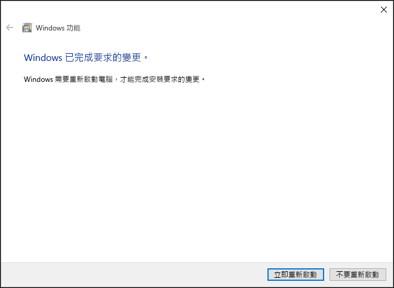
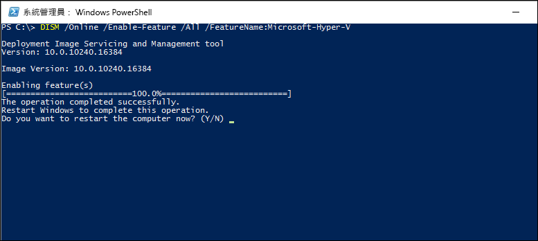

# 在 Windows 10 上安裝 Hyper-V

您必須先啟用 Hyper-V 角色，才可以在 Windows 10 上建立虛擬機器。 方法很多，可以使用 Windows 10 控制台、PowerShell 或部署映像服務與管理工具 (DISM)。 本文件會逐步解說每一種方法。

> 啟用 Hyper-V 之前，請確定您的系統相容。 如需詳細資訊，請參閱 [Windows 10 Hyper-V 系統需求](https://msdn.microsoft.com/virtualization/hyperv_on_windows/quick_start/walkthrough_compatibility)。

## 手動安裝 Hyper-V 角色

1. 以滑鼠右鍵按一下 [Windows] 按鈕，然後選取 [程式和功能]。

2. 選取 **[開啟或關閉 Windows 功能]**。

3. 選取 **[Hyper-V]**，然後按一下 **[確定]**。  



安裝完成時，系統會提示您重新啟動您的電腦。



## 使用 PowerShell 安裝 Hyper-V

1. 以系統管理員身分開啟 PowerShell 主控台。

2. 執行下列命令：

```powershell
Enable-WindowsOptionalFeature -Online -FeatureName Microsoft-Hyper-V -All
```
安裝完成時，您需要重新啟動電腦。

## 使用 DISM 安裝 Hyper-V

部署映像服務與管理工具 (DISM) 可用來服務 Windows 映像，及準備 Windows 安裝前環境。 Windows 作業系統正在執行時，DISM 也可用來啟用它的功能。 如需詳細資訊，請參閱 [DISM - 部署映像服務與管理技術參考](https://technet.microsoft.com/en-us/library/hh824821.aspx)。

使用 DISM 啟動 Hyper-V 角色：

1. 以系統管理員身分開啟 PowerShell 或 CMD 工作階段。

2. 輸入下列命令：

```powershell
DISM /Online /Enable-Feature /All /FeatureName:Microsoft-Hyper-V
```



## 後續步驟 - 建立虛擬交換器
[建立虛擬交換器](walkthrough_virtual_switch.md)


<!--HONumber=Oct16_HO4-->


