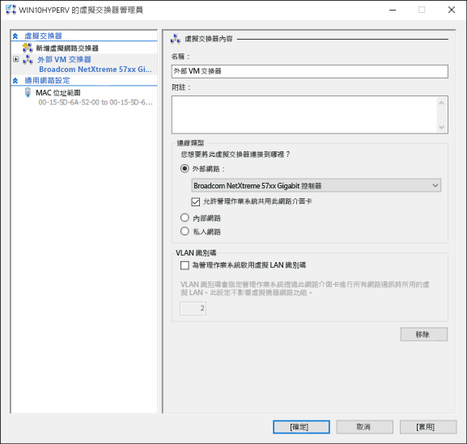

# 建立虛擬交換器 

在 Hyper-V 中建立虛擬機器之前，您可能要提供一個方法讓此虛擬機器連線到實體網路。 Hyper-V 包含以軟體為基礎的網路技術，可讓虛擬機器的網路卡連接至虛擬交換器，提供網路連線。 在 Hyper-V 中建立的每個虛擬交換器可以設定為三種連線類型的其中一種：

- **外部網路** – 虛擬交換器會連接至實體網路介面卡，而由後者提供實體網路、Hyper-V 主機和虛擬機器之間的連線。 在此設定中，您也可以啟用或停用主機透過實體連線的網路卡進行通訊的能力。 這很實用，可以用來隔離 VM 到特定實體網路卡的流量。

- **內部網路** – 虛擬交換器並未連接至實體網路介面卡。 不過，Hyper-V 主機和連接到此交換器的任何虛擬機器之間有網路連線存在。

- **私人網路** – 虛擬交換器並未連接至實體網路介面卡，而且 Hyper-V 主機與連接到此交換器的所有虛擬機器之間都沒有連線。

## 手動建立虛擬交換器

這個練習逐步解說如何使用 Hyper-V 管理員來建立外部虛擬交換器。 完成時，您的 Hyper-V 主機會包含可用來連接虛擬機器和實體網路的虛擬交換器。 

1. 開啟 [Hyper-V 管理員]。

2. 以滑鼠右鍵按一下 Hyper-V 主機的名稱，選取 **[虛擬交換器管理員...]**。

3. 在 [虛擬交換器] 底下，選取 **[新虛擬網路交換器]**。

4. 在 [您要建立哪種類型的虛擬交換器?] 底下，選取 **[外部]**。

5. 選取 **[建立虛擬交換器]** 按鈕。

6. 在 [虛擬交換器內容] 底下，指定新交換器的名稱，例如 **External VM Switch**。

7. 在 [連線類型] 底下，確定已選取 **[外部網路]**。

8. 選取要搭配新虛擬交換器的實體網路卡。 這是實際連線到網路的網路卡。  

    

9. 選取 **[套用]** 建立虛擬交換器。 此時，您會看到下列訊息。 按一下 **[是]** 繼續作業。

      

10. 選取 **[確定]**，關閉 [虛擬交換器管理員] 視窗。

## 使用 PowerShell 建立虛擬交換器

使用下列步驟可以 PowerShell 建立外部連線類型的虛擬交換器。 

1. 使用 **Get-NetAdapter** 傳回連線到 Windows 10 系統的網路介面卡清單。

    ```powershell
    PS C:\> Get-NetAdapter

    Name                      InterfaceDescription                    ifIndex Status       MacAddress             LinkSpeed
    ----                      --------------------                    ------- ------       ----------             ---------
    Ethernet 2                Broadcom NetXtreme 57xx Gigabit Cont...       5 Up           BC-30-5B-A8-C1-7F         1 Gbps
    Ethernet                  Intel(R) PRO/100 M Desktop Adapter            3 Up           00-0E-0C-A8-DC-31        10 Mbps  
    ```

2. 選取要與 Hyper-V 交換器搭配使用的網路介面卡，並在名為 **$net** 的變數中放入一個執行個體。

    ```
    $net = Get-NetAdapter -Name 'Ethernet'
    ```

3. 執行下列命令以建立新的 Hyper-V 虛擬交換器。

    ```
    New-VMSwitch -Name "External VM Switch" -AllowManagementOS $True -NetAdapterName $net.Name
    ```

## 虛擬交換器與膝上型電腦

如果要在膝上型電腦上執行 Windows 10 Hyper-V，您可能想同時為乙太網路和無線網路卡建立虛擬交換器。 有此設定時，您可以根據膝上型電腦連線到網路的方式，在這些交換器之間變更您的虛擬機器。 虛擬機器不會自動在有線和無線之間切換。

## 後續步驟 - 建立虛擬機器
[建立 Windows 虛擬機器](walkthrough_create_vm.md)


<!--HONumber=Oct16_HO4-->


