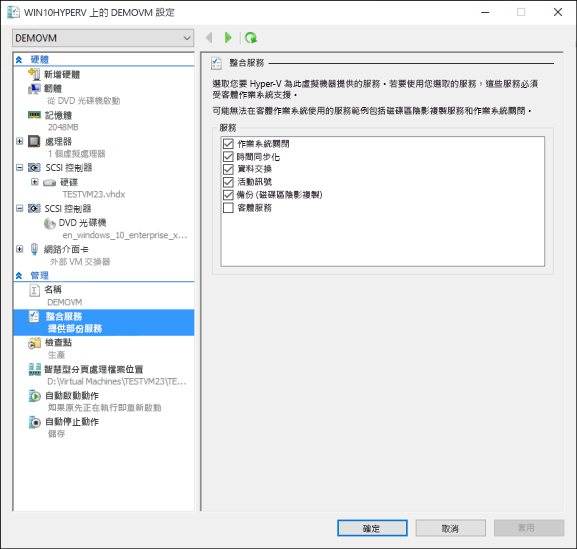
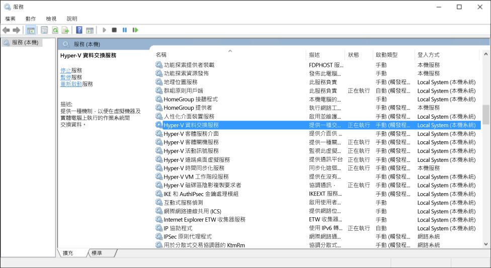

# 管理 Hyper-V 整合服務

整合服務通常稱為「整合元件」，是可讓虛擬機器與 Hyper-V 主機通訊的服務。 其中許多服務很便利 (例如客體檔案複製)，另外有些則對於客體作業系統功能是否能正確運作來說相當重要 (時間同步處理)。

本文會詳細說明如何在 Windows 10 中使用 Hyper-V 管理員和 PowerShell 來管理整合服務。 如需有關每個個別整合服務的詳細資訊，請參閱[整合服務](https://technet.microsoft.com/en-us/library/dn798297.aspx)。

## 使用 Hyper-V 管理員啟用或停用整合服務

1. 選取虛擬機器並開啟設定。
    

2. 在虛擬機器的 [設定] 視窗中，移至 [管理] 下的 [整合服務] 索引標籤。

    

    這裡您會看到此 Hyper-V 主機上所有可用的整合服務。 值得注意的是，客體作業系統不一定會支援所有列出的整合服務。

## 使用 PowerShell 啟用或停用整合服務

您也可以透過 PowerShell 執行 [`Enable-VMIntegrationService`] (https://technet.microsoft.com/en-us/library/hh848500.aspx) 和 [`Disable-VMIntegrationService`] (https://technet.microsoft.com/en-us/library/hh848488.aspx) 來啟用和停用整合服務。

在此範例中，我們將先啟用再停用前例中的 demovm 虛擬機器上的客體檔案複製整合服務。

1. 看看哪些整合服務正在執行

  ``` PowerShell
  Get-VMIntegrationService -VMName "demovm"
  ```

  輸出看起來像這樣：
  ``` PowerShell
  VMName      Name                    Enabled PrimaryStatusDescription SecondaryStatusDescription
  ------      ----                    ------- ------------------------ --------------------------
  demovm      Guest Service Interface False   OK
  demovm      Heartbeat               True    OK                       OK
  demovm      Key-Value Pair Exchange True    OK
  demovm      Shutdown                True    OK
  demovm      Time Synchronization    True    OK
  demovm      VSS                     True    OK
  ```

2. 啟用`客體服務介面`整合服務

   ``` PowerShell
   Enable-VMIntegrationService -VMName "demovm" -Name "Guest Service Interface"
   ```

   若您執行 `Get-VMIntegrationService -VMName "demovm"`，您會看到「客體服務介面」整合服務已啟用。

3. 停用`客體服務介面`整合服務

   ``` PowerShell
   Disable-VMIntegrationService -VMName "demovm" -Name "Guest Service Interface"
   ```

在主機和客體系統上，整合服務皆設計為必須啟用才能運作。 Windows 客體作業系統預設會啟用所有的整合服務，而您可以將其停用。 做法請參閱下一節。


## 從客體作業系統 (Windows) 管理整合服務

> **附註：**停用整合服務可能會嚴重影響主機管理虛擬機器的能力。 整合服務在主機與客體系統上皆必須啟用才能運作。

整合服務在 Windows 中會顯示為服務。 若要啟用或停用整合服務，從虛擬機器內開啟 Windows 服務管理員。



尋找名稱中包含 Hyper-V 的服務。 以滑鼠右鍵按一下您想要啟用或停用的服務，並啟用或停止服務。

或者，若要使用 PowerShell 查看所有整合服務，請執行：

```PowerShell
Get-Service -Name vm*
```

這會傳回類似下列的清單：

```PowerShell
Status   Name               DisplayName
------   ----               -----------
Running  vmicguestinterface Hyper-V Guest Service Interface
Running  vmicheartbeat      Hyper-V Heartbeat Service
Running  vmickvpexchange    Hyper-V Data Exchange Service
Running  vmicrdv            Hyper-V Remote Desktop Virtualizati...
Running  vmicshutdown       Hyper-V Guest Shutdown Service
Running  vmictimesync       Hyper-V Time Synchronization Service
Stopped  vmicvmsession      Hyper-V VM Session Service
Running  vmicvss            Hyper-V Volume Shadow Copy Requestor
```

使用 [`Start-Service`](https://technet.microsoft.com/en-us/library/hh849825.aspx) 或 [`Stop-Service`](https://technet.microsoft.com/en-us/library/hh849790.aspx) 啟動或停止服務。

根據預設，客體作業系統會啟用所有整合服務。

## 從客體作業系統 (Linux) 管理整合服務

Linux 整合服務通常是透過 Linux 核心提供。

在 Linux 客體作業系統執行下列命令，檢查整合服務驅動程式和精靈是否正在執行。

1. Linux 整合服務驅動程式叫做 'hv_utils'。 執行下列命令檢查是否已載入它。

  ``` BASH
  lsmod | grep hv_utils
  ```

  輸出應該看起來像這樣：

  ``` BASH
  Module                  Size   Used by
  hv_utils               20480   0
  hv_vmbus               61440   8 hv_balloon,hyperv_keyboard,hv_netvsc,hid_hyperv,hv_utils,hyperv_fb,hv_storvsc
  ```

2. 在 Linux 客體作業系統執行下列命令，檢查所需的服務精靈是否正在執行。

  ``` BASH
  ps -ef | grep hv
  ```

  輸出應該看起來像這樣：

  ``` BASH
  root       236     2  0 Jul11 ?        00:00:00 [hv_vmbus_con]
  root       237     2  0 Jul11 ?        00:00:00 [hv_vmbus_ctl]
  ...
  root       252     2  0 Jul11 ?        00:00:00 [hv_vmbus_ctl]
  root      1286     1  0 Jul11 ?        00:01:11 /usr/lib/linux-tools/3.13.0-32-generic/hv_kvp_daemon
  root      9333     1  0 Oct12 ?        00:00:00 /usr/lib/linux-tools/3.13.0-32-generic/hv_kvp_daemon
  root      9365     1  0 Oct12 ?        00:00:00 /usr/lib/linux-tools/3.13.0-32-generic/hv_vss_daemon
  scooley  43774 43755  0 21:20 pts/0    00:00:00 grep --color=auto hv          
  ```

  若要查看可使用哪些精靈，請執行：
  ``` BASH
  compgen -c hv_
  ```

  輸出應該看起來像這樣：

  ``` BASH
  hv_vss_daemon
  hv_get_dhcp_info
  hv_get_dns_info
  hv_set_ifconfig
  hv_kvp_daemon
  hv_fcopy_daemon     
  ```

  您可能會看到這些整合服務精靈：
* **`hv_vss_daemon`** – 建立即時的 Linux 虛擬機器備份需要此精靈。
* * *`hv_kvp_daemon`* * – 此精靈可以設定和查詢內建和外來機碼值組。
* * *`hv_fcopy_daemon`* * – 此精靈可實作主機和客體之間的檔案複製服務。

> **附註：**如果無法使用上述整合服務精靈，可能是您的系統不支援或未安裝它們。 移至[這裡](https://technet.microsoft.com/en-us/library/dn531030.aspx)取得更多 disto 特定資訊。

在此範例中，我們會停止並啟動 KVP 精靈 `hv_kvp_daemon`。

使用上述輸出第二個資料行中的 pid (處理序識別碼) 停止精靈的處理序。 或者，您可以使用 `pidof` 找到正確的處理序。 因為 Hyper-V 精靈是以 root 身分執行，您需要根權限。

``` BASH
sudo kill -15 `pidof hv_kvp_daemon`
```

現在，如果您再次執行 `ps-ef | hv` 同樣地，將會發現所有 `hv_kvp_daemon` 處理序已消失。

若要再次啟動精靈，請以 root 身分執行精靈。

``` BASH
sudo hv_kvp_daemon
```

現在，如果您再次執行 `ps-ef | hv`，將會發現 `hv_kvp_daemon` 處理序有了新的處理序識別碼。


## 整合服務的維護

為了獲得最佳的虛擬機器效能和功能，請使用最新的整合服務。

**在 Windows 10 主機上執行的虛擬機器：**

| 客體作業系統| 更新機制| 附註|
|:---------|:---------|:---------|
| Windows 10| Windows Update| |
| Windows 8.1| Windows Update| |
| Windows 8| Windows Update| 需要「資料交換」整合服務。*****|
| Windows 7| Windows Update| 需要「資料交換」整合服務。*****|
| Windows Vista (SP 2)| Windows Update| 需要「資料交換」整合服務。*****|
| -| | |
| Windows Server 2012 R2| Windows Update| |
| Windows Server 2012| Windows Update| 需要「資料交換」整合服務。*****|
| Windows Server 2008 R2| Windows Update| 需要「資料交換」整合服務。*****|
| Windows Server 2008 (SP 2)| Windows Update| 需要「資料交換」整合服務。*****|
| Windows Home Server 2011| Windows Update| 需要「資料交換」整合服務。*****|
| Windows Small Business Server 2011| Windows Update| 需要「資料交換」整合服務。*****|


**\ *** 如果無法啟用「資料交換」整合服務，可以在[這裡](https://support.microsoft.com/en-us/kb/3071740)從下載中心取得這些客體的整合元件封包檔 (cab)。 [這裡](http://blogs.technet.com/b/virtualization/archive/2015/07/24/integration-components-available-for-virtual-machines-not-connected-to-windows-update.aspx)有套用 cab 的指示。


**在 Windows 8.1 主機上執行虛擬機器：**

| 客體作業系統| 更新機制| 附註|
|:---------|:---------|:---------|
| Windows 10| Windows Update| |
| Windows 8.1| Windows Update| |
| Windows 8| 整合服務光碟| |
| Windows 7| 整合服務光碟| |
| Windows Vista (SP 2)| 整合服務光碟| |
| Windows XP (SP 2、SP 3)| 整合服務光碟| |
| -| | |
| Windows Server 2012 R2| Windows Update| |
| Windows Server 2012| 整合服務光碟| |
| Windows Server 2008 R2| 整合服務光碟| |
| Windows Server 2008 (SP 2)| 整合服務光碟| |
| Windows Home Server 2011| 整合服務光碟| |
| Windows Small Business Server 2011| 整合服務光碟| |
| Windows Server 2003 R2 (SP 2)| 整合服務光碟| |
| Windows Server 2003 (SP 2)| 整合服務光碟| |

**在 Windows 8 主機上執行虛擬機器：**

| 客體作業系統| 更新機制| 附註|
|:---------|:---------|:---------|
| Windows 8.1| Windows Update| |
| Windows 8| 整合服務光碟| |
| Windows 7| 整合服務光碟| |
| Windows Vista (SP 2)| 整合服務光碟| |
| Windows XP (SP 2、SP 3)| 整合服務光碟| |
| -| | |
| Windows Server 2012 R2| Windows Update| |
| Windows Server 2012| 整合服務光碟| |
| Windows Server 2008 R2| 整合服務光碟| |
| Windows Server 2008 (SP 2)| 整合服務光碟| |
| Windows Home Server 2011| 整合服務光碟| |
| Windows Small Business Server 2011| 整合服務光碟| |
| Windows Server 2003 R2 (SP 2)| 整合服務光碟| |
| Windows Server 2003 (SP 2)| 整合服務光碟| |

[這裡](https://technet.microsoft.com/en-us/library/hh846766.aspx#BKMK_step4)有透過整合服務光碟來更新 Windows 8 和 Windows 8.1 的指示。

**\*\*** 在[這裡](https://technet.microsoft.com/en-us/library/dn531030.aspx)可以找到 Linux 客體的更多相關資訊。


