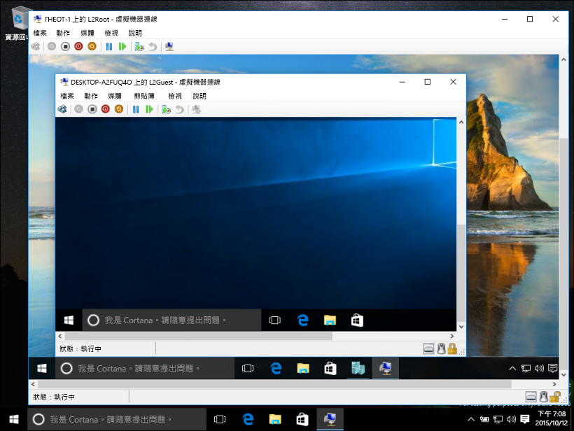
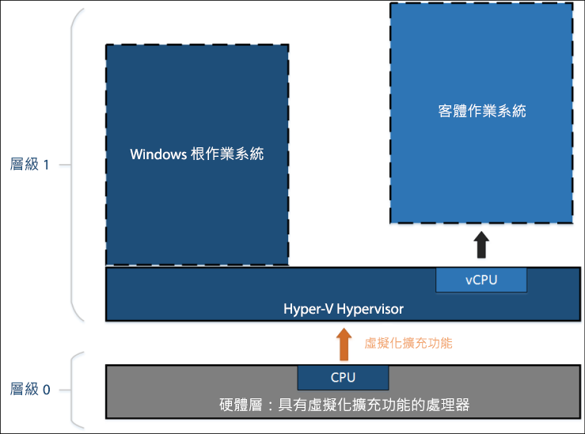
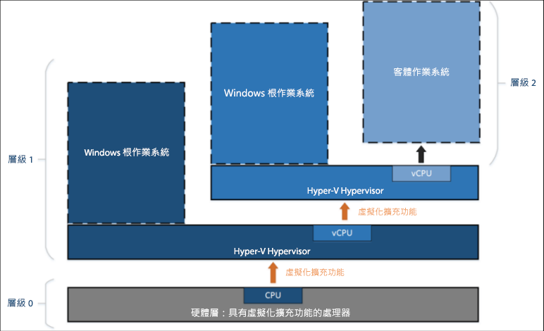

# 巢狀虛擬化

> **附註：**這個早期預覽功能僅供執行組建 10565 或更新版本的 Windows Insider 使用，且不附帶任何效能或穩定性的保證。

巢狀虛擬化是在虛擬化的環境中執行虛擬化。 換句話說，巢狀結構可讓您在虛擬機器中執行 Hyper-V 伺服器角色。



Hyper-V 仰賴硬體虛擬化支援 (例如 Intel VT-x 和 AMD-V) 來執行虛擬機器。 一般而言，一旦安裝 Hyoer-V，Hypervisor 會向客體虛擬機器隱藏這項功能。 這可防止客體虛擬機器在其他 Hypervisor 之間執行 Hyper-V 伺服器角色。

巢狀虛擬化會向客體虛擬機器公開這些硬體虛擬化支援元件。

下圖顯示非巢狀的 Hyper-V。 Hyper-V Hypervisor 會完全掌控硬體虛擬化延伸模組 (橘色箭號)，且不會向客體作業系統公開它們。



另一方面，下圖顯示巢狀的 Hyper-V。 在此情況下，Hyper-V 會向其虛擬機器公開硬體虛擬化延伸模組。 啟用巢狀後，客體虛擬機器可以安裝自己的 Hypervisor，並執行它自己的客體 VM。



## 巢狀虛擬化的需求

在啟用巢狀虛擬化之前，請注意這是預覽。 請勿在生產環境中使用巢狀結構。

需求：
* 最少 4 GB RAM。 巢狀虛擬化需要理想的記憶體數量。
* 兩種 Hypervisor 皆需要最新的 Windows Insider 組建 (10565 或更高)。 其他 Hypervisor 無法運作。
* 這項功能目前僅限用於 Intel。 需要有 Intel VT-x。

## 啟用巢狀虛擬化

1. 建立與您的主機執行相同組建的虛擬機器 -- [這裡提供指示](../quick_start/walkthrough_create_vm.md)。

2. 在 Hyper-V 主機上以系統管理員身分執行[這個指令碼](https://github.com/Microsoft/Virtualization-Documentation/blob/master/hyperv-tools/Nested/Enable-NestedVm.ps1)。

    在這個早期預覽中，巢狀附帶幾個設定需求。 為了讓工作更容易，[這個 PowerShell 指令碼](https://github.com/Microsoft/Virtualization-Documentation/blob/master/hyperv-tools/Nested/Enable-NestedVm.ps1)指令碼會檢查您的設定，變更任何不正確的項目，並啟用指定虛擬機器的巢狀虛擬化。

  ``` PowerShell
  Invoke-WebRequest https://raw.githubusercontent.com/Microsoft/Virtualization-Documentation/master/hyperv-tools/Nested/Enable-NestedVm.ps1 -OutFile ~/Enable-NestedVm.ps1 
  ~/Enable-NestedVm.ps1 -VmName "DemoVM"
  ```

3. 在虛擬機器中安裝 Hyper-V。

  ``` PowerShell
  Invoke-Command -VMName "DemoVM" -ScriptBlock { Enable-WindowsOptionalFeature -FeatureName Microsoft-Hyper-V -Online; Restart-Computer }
  ```

4. 建立巢狀的虛擬機器！

## 已知問題

以下是已知問題的清單：
* 啟用 Device Guard 的主機無法向客體公開虛擬化延伸模組。

* 啟用虛擬式安全性 (VBS) 的主機無法向客體公開虛擬化延伸模組。 若要預覽巢狀虛擬化，必須先停用 VBS。

* 虛擬機器一旦啟用巢狀虛擬化，下列功能將不再與該 VM 相容。  
    這些動作將會失敗，或是會造成裝載其他虛擬機器的虛擬機器無法啟動：
    * 動態記憶體必須「關閉」。 這將導致 VM 無法開機。
    * 執行階段記憶體大小調整將會失敗。
    * 將檢查點套用至執行中的 VM 將會失敗。
    * 即時移轉將會失敗 -- 也就是說，無法即時移轉裝載其他 VM 的 VM。
    * 儲存/還原將會失敗。

    > **附註：**這些功能仍然能在「最內層」的客體 VM 中運作。 限制只適用於第一層 VM。

* 啟用巢狀虛擬化後，必須啟用虛擬機器的 MAC 詐騙，網路功能才能在「最內層」客體運作。

## 常見問題和疑難排解

### 我的虛擬機器無法啟動，我該怎麼做？

1. 請確認動態記憶體已「關閉」。
2. 在主機電腦上，從提高權限的提示執行這個 PowerShell 指令碼。

    此指令碼會報告主機和 VM 是否已針對巢狀正確地進行設定。

  ``` PowerShell
  Invoke-WebRequest https://raw.githubusercontent.com/Microsoft/Virtualization-Documentation/master/hyperv-tools/Nested/Get-NestedVirtStatus.ps1 -OutFile ~/Get-NestedVirtStatus.ps1 
  ~/Get-NestedVirtStatus.ps1
  ```

### 與虛擬機器一直失去連線。

如果您使用空白密碼 (這是已知的問題)， 請變更您的密碼，應能解決問題。

### 我的問題不在這裡。

沒看見您的問題嗎？ 想提供任何意見？ 請與我們連絡。

請透過 Windows 意見反應應用程式、[虛擬化論壇](https://social.technet.microsoft.com/Forums/windowsserver/En-us/home?forum=winserverhyperv)或 [GitHub](https://github.com/Microsoft/Virtualization-Documentation) 回報問題。


