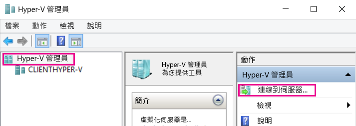
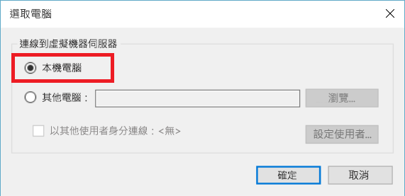
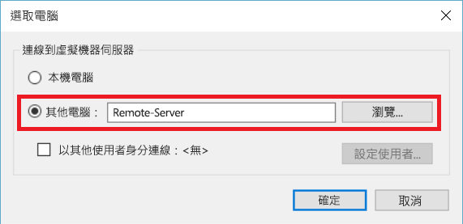
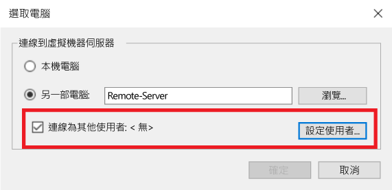

# 使用 Hyper-V 管理員管理遠端 Hyper-V 主機

Hyper-V 管理員是內建工具，可以診斷及管理本機 Hyper-V 主機和少量的遠端主機。 本文記載使用 Hyper-V 管理員中所有支援的設定，連線到 Hyper-V 主機的設定步驟。

> 在[任何包含 Hyper-V 的 Windows 作業系統](../quick_start/walkthrough_compatibility.md#OperatingSystemRequirements)上，可透過 **[程式和功能]** 的 **[Hyper-V 管理工具]** 取得 Hyper-V 管理員。 Hyper-V 平台不需要啟用，即能管理遠端主機。

若要在 Hyper-V 管理員中連線到 Hyper-V 主機，請確定在左側窗格中已選取 **[Hyper-V 管理員]**，然後在右窗格中選取 **[連線到伺服器...]**。



## Hyper-V 管理員支援的 Hyper-V 主機組合

在 Windows 10 中 Hyper-V 管理員可讓您管理下列 Hyper-V 主機：
* Windows 10
* Windows 8.1
* Windows 8
* Windows Server 2012 R2 + Windows Server Core、Datacenter 和 Hyper-V Server
* Windows 2012 + Windows Server Core、Datacenter 和 Hyper-V Server

在 Windows 8.1 和 Windows Server 2012 R2 中 Hyper-V 管理員可讓您管理：
* Windows 8.1
* Windows 8
* Windows Server 2012 R2 + Windows Server Core、Datacenter 和 Hyper-V Server
* Windows 2012 + Windows Server Core、Datacenter 和 Hyper-V Server

在 Windows 8 和 Windows Server 2012 中 Hyper-V 管理員可讓您管理：
* Windows 8
* Windows 2012 + Windows Server Core、Datacenter 和 Hyper-V Server

從 Windows 8 開始，變成可以在 Windows 上使用 Hyper-V。 Windows 8.1/Server 2012 之前，Hyper-V 管理員只能管理版本相符的 Hyper-V。

> **附註：**Hyper-V 管理員的功能符合您所管理之版本可用的功能。 換句話說，如果您從 Server 2012R2 管理遠端 Server 2012 主機，將無法使用 2012R2 中的新 Hyper-V 管理員工具。

## 管理 localhost

若要將 localhost 以 Hyper-V 主機加入至 Hyper-V 管理員，請在 **[選取電腦]** 對話方塊中選取 **[本機電腦]**。



如果無法建立連線：
*  請確定已啟用「Hyper-V 平台」角色。  
    請參閱[檢查相容性的逐步解說小節](../quick_start/walkthrough_compatibility.md)，以了解是否支援 Hyper-V。
*  請確認您的使用者帳戶屬於「Hyper-V 系統管理員」群組的一員。


## 管理相同的網域中的另一部 Hyper-V 主機

若要將遠端 Hyper-V 主機加入 Hyper-V 管理員，請在 [選取電腦]**** 對話方塊中選取 [另一台電腦]****，然後在文字欄位中輸入遠端主機的主機名稱、NetBIOS 或 FQDN。



為了管理遠端 Hyper-V 主機，在本機電腦和遠端主機上皆必須啟用遠端管理。

您可以透過 [系統內容] -> [遠端管理設定]`` 啟用，或以系統管理員身分執行下列 PowerShell 命令：

``` PowerShell
winrm quickconfig
```

如果您目前的使用者帳戶符合遠端主機上 Hyper-V 系統管理員帳戶，請繼續作業，按 **[確定]** 以連線。

> 這是在 Windows 8 或 Windows 8.1 中用 Hyper-V 管理員管理遠端主機的唯一支援方法。


Windows 10 大幅擴充遠端連線類型的可能組合。  
現在您可以使用主機名稱或 IP 位址連線到遠端 Windows 10 或更新版本的主機。 Hyper-V 管理員現在也支援備用的使用者認證。


### 以不同的使用者身分連線至遠端主機

> 此功能僅適用於連線到 Windows 10 或 Server 2016 技術預覽第三版或更新版本的遠端主機

在 Windows 10 中，如果您不是以遠端主機的正確使用者帳戶執行，可以其他使用者身分和備用認證的進行連線。

若要指定遠端 Hyper-V 主機的認證，請在 [選取電腦] 對話方塊中選取 **[以其他使用者身分連線:]**，然後選取 **[設定使用者...]**。




### 使用 IP 位址連線至遠端主機

> 此功能僅適用於連線到 Windows 10 或 Server 2016 技術預覽第三版或更新版本的遠端主機

有時候使用 IP 位址進行連線比用主機名稱更容易。 Windows 10 允許您這麼做。

若要使用 IP 位址連線，請在 **[另一台電腦]** 文字欄位中輸入 IP 位址。


## 管理網域外 (或沒有網域) 的 Hyper-V 主機

> 此功能僅適用於連線到 Windows 10 或 Server 2016 技術預覽第三版或更新版本的遠端主機

在要管理的 Hyper-V 主機上，以系統管理員身分執行下列命令：

1.  [Enable-PSRemoting](https://technet.microsoft.com/en-us/library/hh849694.aspx)
    * [Enable-psremoting](https://technet.microsoft.com/en-us/library/hh849694.aspx) 會為*私人*網路區域建立必要的防火牆規則。 若要在公用區域上允許這項存取，您必須啟用 CredSSP 和 WinRM 的這條規則。
2. Set-Item WSMan:\localhost\Client\TrustedHosts -value "fqdn-of-managing-pc"
    * 或者，您可以透過以下命令讓所有主機受信任以進行管理：
    * Set-Item WSMan:\localhost\Client\TrustedHosts -value * -force
3. [Enable-WSManCredSSP](https://technet.microsoft.com/en-us/library/hh849872.aspx) -Role client -DelegateComputer "fqdn-of-managing-pc"
    * 或者，您可以透過以下命令讓所有主機受信任以進行管理：
    * [Enable-WSManCredSSP](https://technet.microsoft.com/en-us/library/hh849872.aspx) -Role client -DelegateComputer *


