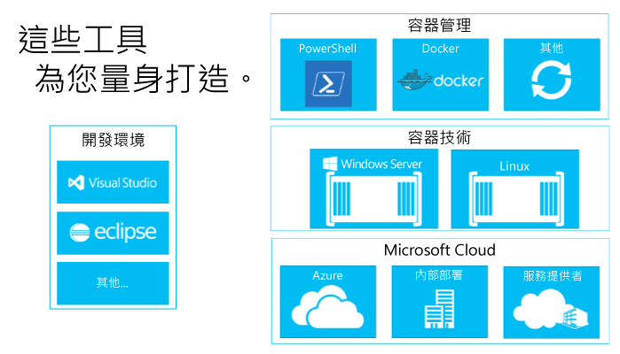

# 關於建立容器生態系統

若要瞭解為何建立容器生態系統是非常重要的，讓我們先談談其元件。

## 容器生態系統的元件

Windows 容器是大型容器生態系統的重要元件。 我們正著力於此產業，以期能讓開發人員選擇各種層級的解決方案組合。

容器生態系統提供管理、共用和開發在容器中執行之應用程式的方式。

Microsoft 想要讓開發人員在建置這些新一代的應用程式時有所選擇並保有生產力。 我們的目標是要提升開發人員的產能，這表示讓應用程式能以任何 Microsoft 雲端為目標，而不需要修改、重寫或重新設定程式碼。

Microsoft 致力於開放和生態系統。 我們積極支援多個相關開發人員生態系統（例如 Windows 和 Linux）的組合，以推動創新。

在接下來的幾個月，我們將提供有關此開發生態系統中其他合作夥伴的詳細資訊。