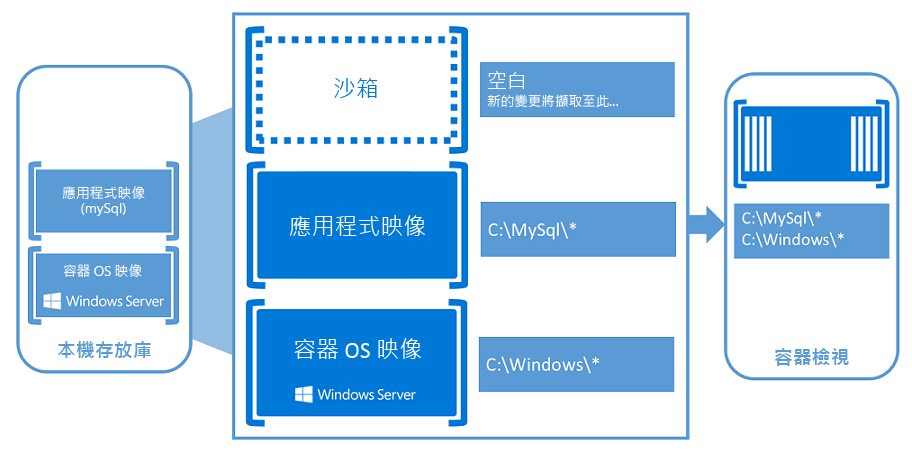

# 關於 Windows 容器

假設有一間廚房。 在這個單一房間內, 就是您需要的所有工作: oven、pan、水池等。 這是我們的容器。

現在, 請想像將這個廚房放在建築物內, 就像將書籍滑動成 bookshelf 一樣輕鬆。 由於廚房所需功能的一切都已經存在, 所以我們必須開始烹飪, 才能連接電力與管道。

為什麼要停止？ 您可以以您喜歡的方式自訂您的組建;您可以在許多房間中填入內容、使用相同的房間來填滿, 或是結合兩個房間。

在我們的廚房中, 您可以透過執行 app 來執行應用程式, 容器的作用就像這個聊天室。 容器會將應用程式及 app 所需執行的所有內容放入自己的獨立方塊中。 因此, 隔離的 app 不會知道任何其他存在於其容器之外的 app 或進程。 因為容器有應用程式所需執行的所有專案, 所以容器可以在任何地方移動, 只要使用其主機置備的資源, 而不觸及任何為其他容器預配的資源。

下列影片將提供更多關於 Windows 容器可以為您做什麼的資訊, 以及 Microsoft 與 Docker 的合作關係如何協助建立 frictionless 環境以進行開放來源容器開發:

<iframe width="800" height="450" src="https://www.youtube.com/embed/Ryx3o0rD5lY" frameborder="0" allow="accelerometer; autoplay; encrypted-media; gyroscope; picture-in-picture" allowfullscreen></iframe>

## 容器基礎

在您開始使用 Windows 容器時, 讓我們知道您會遇到的一些字詞:

- 容器主機: 使用 Windows 容器功能設定的物理或虛擬電腦系統。 容器主機將會執行一或多個 Windows 容器。
- [沙箱]: 可捕獲您在容器執行期間對容器所做的所有變更 (例如檔案系統修改、登錄修改或軟體安裝) 的圖層。
- 基本影像: 提供容器作業系統環境之容器之影像圖層中的第一個圖層。 無法修改基本影像。
- 容器影像: 建立容器之指示的唯讀範本。 影像可以根據基本且未變更的作業系統環境來建立, 但是也可以從已修改之容器的沙箱中建立。 這些修改後的影像會在基本影像圖層的上方對變更進行圖層, 而且這些圖層可以複製並重新應用到其他基底影像, 以建立含有相同變更的新影像。
- 容器儲存庫: 在您每次建立新影像時, 儲存容器影像及其相依性的本機知識庫。 您可以視需要在容器主機上多次重複使用儲存的影像。 您也可以將容器影像儲存在公用或私人登錄 (例如 Docker 中樞) 中, 以便在許多不同的容器主機中使用它們。
- 容器 orchestrator: 自動化及管理大量容器以及它們彼此互動的程式。 若要深入瞭解, 請參閱[關於 Windows 容器 orchestrators](overview-container-orchestrators.md)。
- Docker: 打包並傳送容器影像的自動化程式。 若要深入瞭解, 請參閱 Windows 上的 docker 引擎、視窗中的[docker 引擎](../manage-docker/configure-docker-daemon.md)或造訪[docker 網站](https://www.docker.com)。

熟悉虛擬機器的人可能會認為容器和虛擬機器看起來像是相似的。 容器會執行作業系統、具有檔案系統, 且可透過網路存取, 就像物理或虛擬電腦系統一樣。 即便如此，容器的基本技術和概念還是與虛擬機器非常不同。 若要深入瞭解這些概念, 請參閱標示 Russinovich 的[博客文章](https://azure.microsoft.com/blog/containers-docker-windows-and-trends/), 說明其他詳細資料的差異。

### Windows 容器類型

您也應該知道有兩種不同的容器類型 (也稱為執行時間)。

Windows Server 容器會透過程式和命名空間隔離技術提供應用程式隔離, 這就是為什麼這些容器也稱為進程隔離容器的原因。 Windows Server 容器可與容器主機和所有執行於主機上的容器共用核心。 這些進程隔離的容器不會提供惡意的安全性界限, 因此不應該用來隔離不受信任的程式碼。 由於共用核心空間，因此這些容器需要相同的核心版本和組態。

在高度優化的虛擬機器中執行每個容器, hyper-v 隔離會針對 Windows Server 容器所提供的隔離展開。 在此設定中, 容器主機不會與相同主機上的其他容器共用其內核。 這些容器的設計是要以虛擬機器的相同安全保證來管控惡意多組織用戶共享。 因為這些容器不會與主機上的主機或其他容器共用內核, 所以它們可以使用不同的版本和配置 (在支援的版本內) 執行內核。 例如, Windows 10 上的所有 Windows 容器都使用 Hyper-v 隔離來利用 Windows Server 內核版本和設定。

在 Windows 上執行容器時, 不論是否為 Hyper-v 隔離, 都是執行時間決策。 您最初可以使用 Hyper-v 隔離建立容器, 然後在執行時間選擇將它作為 Windows Server 容器來執行。

## 容器使用者

### 開發人員容器

容器可協助開發人員以更快的速度建立並傳送較高品質的應用程式。 開發人員可以建立可在整個環境 (以秒為單位) 相同部署的 Docker 影像。 在 Docker 容器中封裝了大量且不斷增加的應用程式體系。 DockerHub, 由 Docker 所維護的公用容器式應用程式登錄, 在其公用群組知識庫中公佈了超過180000的應用程式, 而且該數位仍在不斷增加。

當開發人員 containerizes 應用程式時, 只會將應用程式及它所需執行的元件合併到影像中。 當您需要時，容器可從這個映像建立。 您也可以將映像當作建立另一個映像的基準，使映像建立更為快速。 多個容器可以共用同一個影像, 這表示容器會快速啟動並使用較少的資源。 例如, 開發人員可以使用樹枝來旋轉分散式應用程式的羽量級和便攜 app 元件 (亦稱為微), 並分別快速調整每個服務。

容器是可移植且通用的功能, 可使用任何語言撰寫, 且與執行 Windows Server 2016 的任何電腦相容。 開發人員可以在本機的膝上型電腦或桌上型電腦上建立並測試容器, 然後將這個相同的容器影像部署至其公司的私人雲端、公用雲端或服務提供者。 容器的自然靈活性支援大型、虛擬化雲端環境中的新式 app 開發模式。

### IT 專業人員的容器

容器可協助系統管理員建立更容易更新及維護的基礎結構。 IT 專業人員可以使用容器為開發、QA 及生產團隊提供標準化的環境。 他們不再需要擔心複雜的安裝與設定程式。 透過使用容器, 系統管理員可以在作業系統安裝和基礎基礎結構中擺脫差異。

## 容器101影片簡報

下列影片簡報可讓您深入瞭解 Windows 容器的歷程記錄與實現。

<iframe src="https://channel9.msdn.com/Blogs/containers/Containers-101-with-Microsoft-and-Docker/player" width="800" height="450" allowFullScreen="true" frameBorder="0" scrolling="no"></iframe>

## 試試 Windows Server 容器

準備好開始運用容器的強大威力了嗎？ 下列文章將協助您快速入門:

若要在 Windows Server 上設定容器, 請參閱[Windows server 快速入門](../quick-start/quick-start-windows-server.md)。

若要在 Windows 10 上設定容器, 請參閱[windows 10 快速入門](../quick-start/quick-start-windows-10.md)。