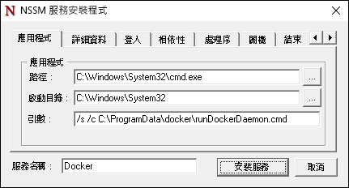
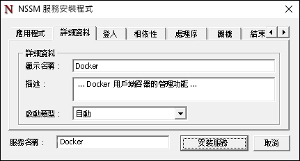
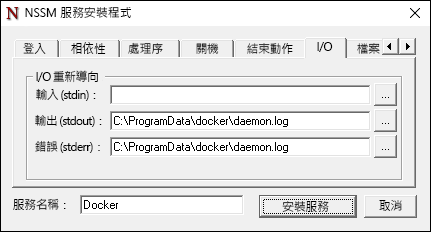

# Docker 和 Windows

**這是初版內容，後續可能會變更。** 

Docker 引擎並未隨附於 Windows，且需要個別安裝及設定。 用來在 Windows 上執行 Docker 引擎的步驟會和在 Linux 上執行的步驟不同。 本文將逐步講解在 Windows Server 2016、Nano Server 和 Windows Client 上安裝和設定 Docker 引擎的步驟。 也請注意，Docker 引擎及命令列介面最近已分割成兩個檔案。 這份文件包含以上兩者的安裝指示。

如需有關 Docker 和 Docker 工具組的詳細資訊，請造訪 [Docker.com](https://www.docker.com/)。 

> 必須先啟動 Windows 容器功能，Docker 才可用來建立及管理 Windows 容器。 如需有關啟動這項功能的指示，請參閱[容器主機部署指南](./docker_windows.md)。

## Windows Server 2016

### 安裝 Docker 精靈 <!--1-->

從 `https://aka.ms/tp5/dockerd` 下載 dockerd.exe，將它放在容器主機的 System32 目錄中。

```none
wget https://aka.ms/tp5/dockerd -OutFile $env:SystemRoot\system32\dockerd.exe
```

建立名為 `c:\programdata\docker` 的目錄。 在此目錄中，建立名為 `runDockerDaemon.cmd` 的檔案。

```none
New-Item -ItemType File -Path C:\ProgramData\Docker\runDockerDaemon.cmd -Force
```

將下列文字複製到 `runDockerDaemon.cmd` 檔案中。

```none
@echo off
set certs=%ProgramData%\docker\certs.d

if exist %ProgramData%\docker (goto :run)
mkdir %ProgramData%\docker

:run
if exist %certs%\server-cert.pem (if exist %ProgramData%\docker\tag.txt (goto :secure))

if not exist %systemroot%\system32\dockerd.exe (goto :legacy)

dockerd -H npipe:// 
goto :eof

:legacy
docker daemon -H npipe:// 
goto :eof

:secure
if not exist %systemroot%\system32\dockerd.exe (goto :legacysecure)
dockerd -H npipe:// -H 0.0.0.0:2376 --tlsverify --tlscacert=%certs%\ca.pem --tlscert=%certs%\server-cert.pem --tlskey=%certs%\server-key.pem
goto :eof

:legacysecure
docker daemon -H npipe:// -H 0.0.0.0:2376 --tlsverify --tlscacert=%certs%\ca.pem --tlscert=%certs%\server-cert.pem --tlskey=%certs%\server-key.pem
```
從 [https://nssm.cc/release/nssm-2.24.zip](https://nssm.cc/release/nssm-2.24.zip) 下載 nssm.exe。

```none
wget https://nssm.cc/release/nssm-2.24.zip -OutFile $env:ALLUSERSPROFILE\nssm.zip
```

將壓縮過的封裝解壓縮。

```none
Expand-Archive -Path $env:ALLUSERSPROFILE\nssm.zip $env:ALLUSERSPROFILE
```

將 `nssm-2.24\win64\nssm.exe` 複製到 `c:\windows\system32` 目錄中。

```none
Copy-Item $env:ALLUSERSPROFILE\nssm-2.24\win64\nssm.exe $env:SystemRoot\system32
```
執行 `nssm install` 以設定 Docker 服務。

```none
start-process nssm install
```

將下列資料輸入到 NSSM 服務安裝程式的對應欄位中。

應用程式索引標籤：

**路徑：**C:\Windows\System32\cmd.exe

**啟動目錄：**C:\Windows\System32

**引數：** /s /c C:\ProgramData\docker\runDockerDaemon.cmd < nul

**服務名稱** - Docker



詳細資料索引標籤：

**顯示名稱：**Docker

**描述：**Docker 精靈可為 Docker 用戶端提供容器的管理功能。



IO 索引標籤：

**輸出 (stdout)：**C:\ProgramData\docker\daemon.log

**錯誤 (stderr)：**C:\ProgramData\docker\daemon.log



完成時按一下 `Install Service` 按鈕。

Docker 精靈現在已設定為 Windows 服務。

### 防火牆 <!--1-->

如果您想要啟動遠端 Docker 管理，您也必須開啟 TCP 連接埠 2376。

```none
netsh advfirewall firewall add rule name="Docker daemon " dir=in action=allow protocol=TCP localport=2376
```

### 移除 Docker <!--1-->

下列命令會移除 Docker 服務。

```none
sc.exe delete Docker
```

### 安裝 Docker CLI

從 `https://aka.ms/tp5/docker` 下載 docker.exe ，並將其置於容器主機的 System32 目錄中，或您將在其中執行 Docker 命令的任何其他系統。

```none
wget https://aka.ms/tp5/docker -OutFile $env:SystemRoot\system32\docker.exe
```

## Nano Server

### 安裝 Docker <!--2-->

從 `https://aka.ms/tp5/dockerd` 下載 dockerd.exe 並將它複製到 Nano Server 容器主機的 `windows\system32` 資料夾。

建立名為 `c:\programdata\docker` 的目錄。 在此目錄中，建立名為 `runDockerDaemon.cmd` 的檔案。

```none
New-Item -ItemType File -Path C:\ProgramData\Docker\runDockerDaemon.cmd -Force
```

將下列文字複製到 `runDockerDaemon.cmd` 檔案中。

```none
@echo off
set certs=%ProgramData%\docker\certs.d

if exist %ProgramData%\docker (goto :run)
mkdir %ProgramData%\docker

:run
if exist %certs%\server-cert.pem (if exist %ProgramData%\docker\tag.txt (goto :secure))

if not exist %systemroot%\system32\dockerd.exe (goto :legacy)

dockerd -H npipe:// 
goto :eof

:legacy
docker daemon -H npipe:// 
goto :eof

:secure
if not exist %systemroot%\system32\dockerd.exe (goto :legacysecure)
dockerd -H npipe:// -H 0.0.0.0:2376 --tlsverify --tlscacert=%certs%\ca.pem --tlscert=%certs%\server-cert.pem --tlskey=%certs%\server-key.pem
goto :eof

:legacysecure
docker daemon -H npipe:// -H 0.0.0.0:2376 --tlsverify --tlscacert=%certs%\ca.pem --tlscert=%certs%\server-cert.pem --tlskey=%certs%\server-key.pem
```

下列指令碼可以用來建立排程工作，會在 Windows 開機時啟動 Docker 精靈。

```none
# Creates a scheduled task to start docker.exe at computer start up.

$dockerData = "$($env:ProgramData)\docker"
$dockerDaemonScript = "$dockerData\runDockerDaemon.cmd"
$dockerLog = "$dockerData\daemon.log"
$action = New-ScheduledTaskAction -Execute "cmd.exe" -Argument "/c $dockerDaemonScript > $dockerLog 2>&1" -WorkingDirectory $dockerData
$trigger = New-ScheduledTaskTrigger -AtStartup
$settings = New-ScheduledTaskSettingsSet -Priority 5
Register-ScheduledTask -TaskName Docker -Action $action -Trigger $trigger -Settings $settings -User SYSTEM -RunLevel Highest | Out-Null
Start-ScheduledTask -TaskName Docker 
```

### 防火牆 <!--2-->

如果您想要啟動遠端 Docker 管理，您也必須開啟 TCP 連接埠 2376。

```none
netsh advfirewall firewall add rule name="Docker daemon " dir=in action=allow protocol=TCP localport=2376
```

### 互動式 Nano 工作階段

Nano Server 是透過遠端 PowerShell 工作階段管理。 如需從遠端管理 Nano Server 的詳細資訊，請參閱 [Getting Started with Nano Server]( https://technet.microsoft.com/en-us/library/mt126167.aspx#bkmk_ManageRemote) (開始使用 Nano Server)。

並非所有的 Docker 作業 (像是 'docker attach') 都可以透過此遠端 PowerShell 工作階段執行。 通常解決之道和最佳做法是透過安全的 TCP 連線從遠端用戶端管理 Docker。

若要這樣做，請確定已將 Docker 精靈設定為接聽 TCP 連接埠，且可在遠端用戶端電腦上使用 Docker 命令列介面。 設定時，可以將 Docker 命令發出至具有 -H 參數的主機。 如需有關從遠端系統存取 Docker 精靈的詳細資訊，請參閱 [Daemon socket options on Docker.com](https://docs.docker.com/engine/reference/commandline/daemon/#daemon-socket-option) (Docker.com 上的精靈通訊端選項)。

若要從遠端部署容器並進入互動式工作階段，請執行下列命令。

```none
docker -H tcp://<ipaddress of server>:2376 run -it nanoserver cmd
```

您可建立會移除 -H 參數需求的環境變數 DOCKER_HOST。 您可以使用下列 PowerShell 命令來完成此作業。

```none
$env:DOCKER_HOST = "tcp://<ipaddress of server:2376"
```

使用此變數集時，此命令現在會看起來像這樣。

```none
docker run -it nanoserver cmd
```

### 移除 Docker <!--2-->

若要從 Nano Server 中移除 Docker 精靈和 CLI，請從 Windows\system32 目錄中刪除 `docker.exe`。

```none
Remove-Item $env:SystemRoot\system32\docker.exe
``` 

執行下列命令取消註冊 Docker 排定的工作。

```none
Get-ScheduledTask -TaskName Docker | UnRegister-ScheduledTask
```

### 安裝 Docker CLI

從 `https://aka.ms/tp5/docker` 下載 docker.exe，並將其複製到 Nano Server 容器主機的 windows\system32 資料夾中。

```none
wget https://aka.ms/tp5/docker -OutFile $env:SystemRoot\system32\docker.exe
```

## 設定 Docker 啟動

Docker 精靈有數種啟動選項可使用。 本節中，將詳細說明這些在 Windows 上的 Docker 精靈相關部分。 如需完整涵蓋所有的精靈選項，請參閱 [Docker daemon documentation on docker.com]( https://docs.docker.com/engine/reference/commandline/daemon/) (docker.com 上的 Docker 精靈文件)

### 接聽 TCP 連接埠

Docker 精靈可以設定為透過具名管道或遠端透過 TCP 連線接聽本機連入連線。 預設啟動行為是只接聽具名管道，這會防止遠端連線。

```none
docker daemon -D
```

這可以使用下列啟動命令修改為接聽安全的連入連線。 如需有關保障連線安全的詳細資訊，請參閱 [Security Configuration docs on docker.com](https://docs.docker.com/engine/security/https/) (docker.com 上的安全性設定文件)。

```none
docker daemon -D -H npipe:// -H tcp://0.0.0.0:2376 --tlsverify --tlscacert=%certs%\ca.pem --tlscert=%certs%\server-cert.pem --tlskey=%certs%\server-key.pem
``` 

### 具名管道存取

在容器主機上以本機執行的 Docker 命令是透過具名管道所接收。 若要執行這些命令，需要系統管理存取權。 另一個選項是指定一個可存取具名管道的群組。 在下列範例中，會給予名為 `docker` 的 Windows 群組此權限。

```none
dockerd -H npipe:// -G docker
```  


### 預設執行階段

Windows 容器具有兩個不同的執行階段類型，Windows Server 和 Hyper-V 。 Docker 精靈已經設定成預設使用 Windows Server 的執行階段，不過這項設定可以變更。 若要將 Hyper-V 設定為預設的執行階段，請在將 Docker 精靈初始化時指定 ‘—exec-opt isolation=hyperv`。

```none
docker daemon -D —exec-opt isolation=hyperv
```


<!--HONumber=May16_HO5-->


