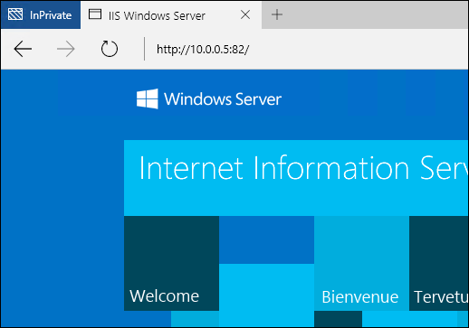

# 容器的網路功能

**這是初版內容，後續可能會變更。**

Windows 容器在網路功能方面類似於虛擬機器。 每個容器都有一個連線到虛擬交換器的虛擬網路介面卡，用以轉送輸入和輸出流量。 提供兩種類型的網路設定。

- **網路位址轉譯模式** – 每個容器連線到內部虛擬交換器，並接收內部 IP 位址。 NAT 設定會將此內部位址轉譯為容器主機的外部位址。

- **透明模式** – 每個容器連線到外部虛擬交換器，並接收來自 DHCP 伺服器的 IP 位址。

這份文件會詳細說明以上各項的優點和設定。

## NAT 網路模式

**網路位址轉譯** – 此設定由 NAT 類型的內部網路交換器和 WinNat 組成。 在此設定中，容器主機具有可從網路上與之連線的「外部」IP 位址。 所有容器都會獲派無法在網路上存取的「內部」位址。 若要在此設定中讓容器可供存取，主機的外部連接埠需要對應至容器的內部連接埠。 這些對應儲存在 NAT 連接埠對應表中。 容器可透過主機的 IP 位址和外部連接埠存取，主機會將流量轉送至容器的內部 IP 位址和連接埠。 NAT 的好處是容器主機可以擴充至數百個容器，而只使用一個可供外部使用的 IP 位址。 此外，NAT 還可讓多個容器裝載可能需要相同通訊連接埠的應用程式。

### 主機設定

若要設定網路位址轉譯的容器主機，請遵循下列步驟。

建立類型為 'NAT' 的虛擬交換器，並設定其內部子網路。 如需 **New-VMSwitch** 命令的詳細資訊，請參閱 [New-VMSwitch 參考](https://technet.microsoft.com/en-us/library/hh848455.aspx)。

```powershell
New-VMSwitch -Name "NAT" -SwitchType NAT -NATSubnetAddress "172.16.0.0/12"
```
建立網路位址轉譯物件。 此物件負責 NAT 位址轉譯。 如需 **New-NetNat** 命令的詳細資訊，請參閱 [New-NetNat 參考](https://technet.microsoft.com/en-us/library/dn283361.aspx)

```powershell
New-NetNat -Name NAT -InternalIPInterfaceAddressPrefix "172.16.0.0/12" 
```

### 容器設定

建立 Windows 容器時，可以選取容器的虛擬交換器。 當容器連線到設定為使用 NAT 的虛擬交換器時，容器會收到已轉譯的位址。

這個範例會建立一個容器，而此容器會連線到已啟用 NAT 的虛擬交換器。

```powershell
New-Container -Name DemoNAT -ContainerImageName WindowsServerCore -SwitchName "NAT"
```

啟動容器之後，可以從容器內檢視 IP 位址。

```powershell
[DemoNAT]: PS C:\> ipconfig

Windows IP Configuration
Ethernet adapter vEthernet (Virtual Switch-527ED2FB-D56D-4852-AD7B-E83732A032F5-0):
   Connection-specific DNS Suffix  . : contoso.com
   Link-local IPv6 Address . . . . . : fe80::384e:a23d:3c4b:a227%16
   IPv4 Address. . . . . . . . . . . : 172.16.0.2
   Subnet Mask . . . . . . . . . . . : 255.240.0.0
   Default Gateway . . . . . . . . . : 172.16.0.1
```

如需有關啟動及連線到 Windows 容器的詳細資訊，請參閱 [管理容器](./manage_containers.md)。

### 連接埠對應

若要存取「已啟用 NAT」的容器內的應用程式，需要在容器和容器主機之間建立連接埠對應。 若要建立對應，您需要容器的 IP 位址、「內部」容器連接埠和「外部」主機連接埠。

這個範例會在主機的連接埠 **80** 到容器 (IP 位址為 **172.16.0.2**) 的連接埠 **80** 之間建立對應。

```powershell
Add-NetNatStaticMapping -NatName "Nat" -Protocol TCP -ExternalIPAddress 0.0.0.0 -InternalIPAddress 172.16.0.2 -InternalPort 80 -ExternalPort 80
```

這個範例會在容器主機的連接埠 **82** 到容器 (IP 位址為 **172.16.0.3**) 的連接埠 **80** 之間建立對應。

```powershell
Add-NetNatStaticMapping -NatName "Nat" -Protocol TCP -ExternalIPAddress 0.0.0.0 -InternalIPAddress 172.16.0.3 -InternalPort 80 -ExternalPort 82
```
> 每個外部連接埠需要有對應的防火牆規則。 這可使用 `New-NetFirewallRule` 來建立。 如需詳細資訊，請參閱 [New-NetFirewallRule 參考](https://technet.microsoft.com/en-us/library/jj554908.aspx)。

建立連接埠對應之後，即可透過容器主機 (實體或虛擬) 的 IP 位址和公開的外部連接埠存取容器應用程式。 例如，下圖說明 NAT 設定及一個以容器主機的外部連接埠 **82** 為目標的要求。 根據連接埠對應，此要求會傳回容器 2 中裝載的應用程式。


從網際網路瀏覽器中檢視要求。



## 透明網路模式

**透明網路功能** – 此設定由外部網路交換器組成。 在此設定中，每個容器接收來自 DHCP 伺服器的 IP 位址，並透過此 IP 位址供外界存取。 此處的優點是不需要維護連接埠對應表。

### 主機設定

若要設定容器系統讓容器可以接收來自 DHCP 伺服器的 IP 位址，請建立連線到實體或虛擬網路介面卡的虛擬交換器。

下列範例以名稱 DHCP 建立虛擬交換器，並使用名為 Ethernet 的網路介面卡。

```powershell
New-VMSwitch -Name DHCP -NetAdapterName Ethernet
```

如果容器主機本身為虛擬機器，您需要在容器交換器所使用的網路介面卡上啟用 MacAddressSpoofing。 下列範例在名為 `DemoVm` 的 VM 上完成這項工作。

```powershell
Get-VMNetworkAdapter -VMName DemoVM | Set-VMNetworkAdapter -MacAddressSpoofing On
```
外部虛擬交換器現在已連線到容器，而容器也能夠接收來自 DHCP 伺服器的 IP 位址。 在此設定中，透過指派給容器的 IP 位址，即可存取裝載於容器內的應用程式。

## Docker 設定

啟動 Docker 精靈時，可以選取網路橋接器。 在 Windows 上執行 Docker 時，這是外部或 NAT 虛擬交換器。 下列範例會啟動 Docker 精靈，並指定名為 `Virtual Switch` 的虛擬交換器。

```powershell
Docker daemon -D -b “Virtual Switch” -H 0.0.0.0:2375
```

如果您已使用「Windows 容器快速入門」中提供的指令碼部署容器主機和 Docker，則已建立 NAT 類型的內部虛擬交換器，也已建立 Docker 服務並預先設定為使用此交換器。 若要變更 Docker 服務所使用的虛擬交換器，需要停止 Docker 服務，修改設定檔，然後重新啟動服務。

若要停止服務，請執行下列 PowerShell 命令。

```powershell
Stop-Service docker
```

設定檔位於 `c:\programdata\docker\runDockerDaemon.cmd`。 編輯下列文字行，將 `Virtual Switch` 取代為 Docker 服務所使用的虛擬交換器名稱。

```powershell
docker daemon -D -b “New Switch Name"
```
最後，啟動服務。

```powershell
Start-Service docker
```

## 管理網路介面卡

有數個 PowerShell 命令可用來管理容器網路介面卡和虛擬交換器連線，而不論網路設定為何 (NAT 或透明)。

管理容器的網路介面卡

- Add-ContainerNetworkAdapter - 將網路介面卡新增至容器。
- Set-ContainerNetworkAdapter - 修改容器的網路介面卡。
- Remove-ContainerNetworkAdapter - 移除容器的網路介面卡。
- Get-ContainerNetworkAdapter - 傳回容器網路介面卡的相關資料。

管理容器網路介面卡與虛擬交換器之間的連線。

- Connect-ContainerNetworkAdapter - 將容器連線到虛擬交換器。
- Disconnect-ContainerNetworkAdapter - 中斷容器與虛擬交換器的連線。

如需這些命令中每個命令的詳細資訊，請參閱[容器 PowerShell 參考](https://technet.microsoft.com/en-us/library/mt433069.aspx)。


<!--HONumber=Feb16_HO4-->


