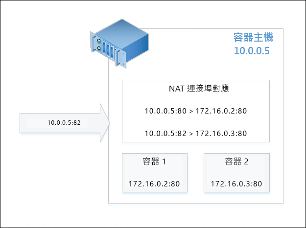

# 容器的網路功能

**這是初版內容，後續可能會變更。** 

Windows 容器在網路功能方面類似於虛擬機器。 每個容器都有一個連線到虛擬交換器的虛擬網路介面卡，用以轉送輸入和輸出流量。 為了強制執行相同主機上的容器隔離，系統會為每個 Windows Server 和 Hyper-V 容器 (其中已針對容器安裝網路介面卡) 建立網路區間。 Windows Server 容器使用主機 vNIC 連結到虛擬交換器。 Hyper-V 容器使用綜合 VM NIC (不向公用程式 VM 公開) 連結到虛擬交換器。

Windows 容器支援四種不同的網路模式。

- **網路位址轉譯模式** – 每個容器連接到內部虛擬交換器，並使用 WinNAT 連接到私人 IP 子網路。 WinNAT 會執行容器主機和容器之間的網路位址轉譯 (NAT) 和連接埠位址 (PAT) 轉譯。

- **廣域網路模式** – 每個容器連接到外部虛擬交換器，並直接連接到實體網路。 其可使用外部 DHCP 伺服器，以靜態或動態方式指派 IP。 原始容器的網路流量範圍是直接用於實體網路，未使用任何位址轉譯。

- **L2 橋接模式** – 每個容器連接到外部虛擬交換器。 如果是相同 IP 子網路中連結至相同容器主機之兩個容器間的網路流量，此模式會直接進行流量橋接。 如果是不同 IP 子網路中連結至不同容器主機之兩個容器間的網路流量，此模式會透過外部虛擬交換器將流量送出。 如果是源自容器出口的網路流量，其來源 MAC 位址會重寫為容器主機的來源 MAC 位址。 如果是以容器入口為目的地的網路流量，其目的地 MAC 位址會重寫為容器主機的目的地 MAC 位址。

- **L2 通道模式** - * (這種模式應該僅限用於 Microsoft 雲端堆疊)*。 其類似於 L2 橋接模式，每個容器會連接到外部虛擬交換器，且出入口的 MAC 位址會被重寫。 不過，不論 Layer-2 連線為何，「所有」容器的網路流量都會轉送到實體主機的虛擬交換器。 這可在實體主機的虛擬交換器中，依據更高層級網路堆疊 (例如網路控制器或網路資源提供者) 的程式設計方式，強制執行網路原則。

這份文件會詳細說明以上各項的優點和設定。

## 建立網路

### 概觀

您可以使用 PowerShell 或 Docker，來建立容器網路、將容器連接至網路，以及設定連接埠轉送規則。 接下來的重點是以 Docker 雲端網路模型 (CNM) 為基礎的 Docker 網路命令。

'transparent'、'nat' 和 'l2bridge' 是可用來建立 Docker 網路的適用驅動程式清單。 如之前所述，L2 通道驅動程式應該僅限用於 Microsoft Azure 公用雲端部署案例中。 

> Docker 網路驅動程式全為小寫。

Docker 精靈是指不同網路模式的驅動程式，其以用來建立網路的驅動程式名稱為依據。 例如，NAT 網路模式對應的 Docker 網路驅動程式名為 nat。 根據預設，Windows 上的 Docker 引擎會尋找具有 NAT 驅動程式的網路。 如果 NAT 網路不存在，則 Docker 引擎會建立一個。 預設會將所有建立的容器連結至 NAT 網路。

您可以在啟動 Docker 精靈引擎時，使用 -b "none" 選項，將特定 "bridge" 指名為 "none"，以覆寫這個行為 (預設會使用 NAT 網路驅動程式)。

若要停止服務，請執行下列 PowerShell 命令。

```none
Stop-Service docker
```

設定檔位於 `c:\programdata\docker\runDockerDaemon.cmd`。 編輯下列程式碼行，並加入 `-b "none"`

```none
dockerd -b "none"
```

重新啟動服務。

```none
Start-Service docker
```

使用 -b "none" 執行 Docker 精靈引擎時，需建立特定網路，並在容器建立/啟動期間參考此網路。

若要列出主機上的可用容器網路，請使用下列 Docker 或 PowerShell 命令。

```none
docker network ls
```
這會輸出類似如下的程式碼：

```none
NETWORK ID          NAME                DRIVER
bd8b691a8286        nat                 nat
7b055c7ed373        none                null
```
或下列 PowerShell 的對等用法：


```none
Get-ContainerNetwork |fl
```

這會輸出類似如下的程式碼：

```none
Name               : nat
SubnetPrefix       : {172.16.0.0/12}
Gateways           : {172.16.0.1}
Id                 : 67ea1851-326d-408b-a5ef-7dcdb15c4438
Mode               : NAT
NetworkAdapterName :
SourceMac          :
DNSServers         : {10.222.118.22, 10.221.228.12, 10.222.114.67}
DNSSuffix          : corp.microsoft.com
IsDeleted          : False
```

> 在 PowerShell 中，網路模式名稱不區分大小寫。


### NAT 網路

**網路位址轉譯** – 此網路模式可用來快速將私人 IP 位址指派給容器。 其會透過對應外部 IP 位址與連接埠 (容器主機) 之間的連接埠，以及內部 IP 位址和容器的連接埠，來提供容器的外部存取權。 外部 IP 位址/連接埠組合上收到的所有網路流量都會與 WinNAT 連接埠對應表進行比較，並轉送至正確的容器 IP 位址和連接埠。 此外，NAT 還可藉由將通訊連接埠與唯一外部連接埠對應，以讓多個容器裝載可能需要相同 (內部) 通訊連接埠的應用程式。 在 TP5 中，只能有一個 NAT 網路。

> 在 TP5 中，會自動為所有 NAT 靜態連接埠對應建立防火牆規則。 此防火牆規則對容器主機來說是通用的，亦不會針對特定容器端點或網路介面卡進行當地語系化。

#### 主機設定 <!--1-->

若要使用 NAT 網路模式，請使用驅動程式名稱 'nat' 建立容器網路。

```none
docker network create -d nat MyNatNetwork
```

您可在 Docker 網路建立命令中，加入閘道 IP 位址 (--gateway=<string[]>) 和子網路首碼 (--subnet=<string[]>) 等其他參數。 如需其他詳細資訊，請參閱下方。

若要使用 PowerShell 建立 NAT 網路，可以使用下列語法。 請注意，您可以使用 PowerShell 指定其他參數，包括 DNSServers 和 DNSSuffix。 如果未指定，這些設定就會繼承容器主機的內容。

```none
New-ContainerNetwork -Name MyNatNetwork -Mode NAT -SubnetPrefix "172.16.0.0/12" [-GatewayAddress <address>] [-DNSServers <address>] [-DNSSuffix <string>]
```

### 廣域網路

**廣域網路** – 此網路模式應該僅限用於需要容器和實體網路之間直接連線的極小部署。 在這個設定中，可透過實體網路，直接存取容器中執行的所有網路服務。 您可以靜態方式指派 IP 位址，方法是假設該位址位於實體網路的 IP 子網路首碼內，且不會與其他實體網路上的 IP 產生衝突。 您也可以透過實體網路上的外部 DHCP 伺服器，以動態方式指派 IP 位址。 如果不使用 DHCP 指派 IP，則可以指定閘道的 IP 位址。 

#### 主機設定 <!--2-->

若要使用廣域網路模式，請使用驅動程式名稱 'transparent' 建立容器網路。 

```none
docker network create -d transparent MyTransparentNetwork
```

此範例會建立廣域網路並指派閘道。

```none
docker network create -d transparent --gateway=10.50.34.1 "MyTransparentNet"
```

PowerShell 命令應如下所示：

```none
New-ContainerNetwork -Name MyTransparentNet -Mode Transparent -NetworkAdapterName "Ethernet"
```

如果容器主機已虛擬化，而且您想要使用 DHCP 進行 IP 指派，則必須在虛擬機器網路介面卡上啟用 MACAddressSpoofing。

```none
Get-VMNetworkAdapter -VMName ContainerHostVM | Set-VMNetworkAdapter -MacAddressSpoofing On
```

### L2 橋接網路

**L2 橋接網路** – 在此設定中，容器主機中的虛擬篩選平台 (VFP) vSwitch 擴充功能會作為橋接器，並視需要執行 Layer-2 位址轉譯 (MAC 地址重寫)。 Layer-3 的 IP 位址和 Layer-4 的連接埠將維持不變。 您可以靜態方式指派 IP 位址，以對應實體網路的 IP 子網路首碼，或對應來自虛擬網路之子網路首碼的 IP (若是使用私人雲端部署的話)。

#### 主機設定 <!--3-->

若要使用 L2 橋接網路模式，請使用驅動程式名稱 'l2bridge' 建立容器網路。 建立 L2 橋接網路時，也必須指定子網路和閘道。

```none
docker network create -d l2bridge --subnet=192.168.1.0/24 --gateway=192.168.1.1 MyBridgeNetwork
```

PowerShell 命令應如下所示：

```none
New-ContainerNetwork -Name MyBridgeNetwork -Mode L2Bridge -NetworkAdapterName "Ethernet"
```

## 移除網路

使用 `docker network rm` 刪除容器網路。

```none
docker network rm "<network name>"
```
或者，使用 PowerShell 的 `Remove-ContainerNetwork`：

透過 PowerShell
```
Remove-ContainerNetwork -Name <network name>
```

這會清除容器網路所使用的任何 Hyper-V 虛擬交換器，以及任何針對 nat 容器網路所建立的網路位址轉譯物件。

## 網路選項

您可以在建立容器網路或建立容器時，指定不同的 Docker 網路選項。 建立容器網路時，除了 -d (--driver=<network mode>) 選項可指定網路模式以外，也支援使用 --gateway、--subnet 和 -o 選項。

### 其他選項

您可使用 `--gateway` 來指定閘道 IP 位址。 這應該僅限於以靜態方式指派 IP 配置時 (廣域網路) 才能完成。

```none
docker network create -d transparent --gateway=10.50.34.1 "MyTransparentNet"
```

您可以使用 `--subnet` 來指定 IP 子網路首碼，其可控制 IP 位址的網路區段配置起點。

```none
docker network create -d nat --subnet=192.168.0.0/24 "MyCustomNatNetwork"
```
您可以使用 -o (--opt=map[]) 參數，透過 Docker 來進行其他容器網路的自訂作業。 

若要指定廣域網路、L2 橋接網路或 L2 通道網路要使用容器主機中的哪個網路介面卡，可指定 *com.docker.network.windowsshim.interface* 選項。 
```none
docker network create -d transparent -o com.docker.network.windowsshim.interface="Ethernet 2" "TransparentNetTwo"
```

> Docker 精靈必須先重新啟動，才能在 Docker 中使用透過 PowerShell 建立的容器網路。 透過 PowerShell 對容器網路進行任何其他變更時，也必須重新啟動 Docker 精靈，變更才會生效。

### 多個容器網路

您可以在單一容器主機上建立多個容器網路，注意事項如下：
* 每個容器主機只能建立一個 NAT 網路。
* 使用外部 vSwitch 進行連線的多個網路 (例如廣域網路、L2 橋接或 L2 廣域網路) 皆必須使用自己的網路介面卡。
* 不同網路必須使用不同的 Vswitch。

### 網路選取

建立 Windows 容器時，可以指定容器網路介面卡要連接的網路。 如果未指定任何網路，則會使用預設 NAT 網路。

若要將容器連結至非預設 NAT 網路 (或正在使用 -b "none" 時)，可搭配使用 --net 選項與 Docker 執行命令。

```none
docker run -it --net=MyTransparentNet windowsservercore cmd
```

### 靜態 IP 位址

您可在容器網路介面卡上設定靜態 IP 位址，其僅支援 NAT、廣域網路和 L2 橋接網路模式。 此外，不支援透過 Docker 進行預設 "nat" 網路的靜態 IP 指派。

```none
docker run -it --net=MyTransparentNet --ip=10.80.123.32 windowsservercore cmd
```

靜態 IP 指派會直接在容器的網路介面卡上執行，且容器必須處於停止狀態，才能執行。 在執行容器時，不支援容器網路介面卡的「熱新增」或變更網路堆疊。

```none
Get-ContainerNetworkAdapter -ContainerName "DemoNAT"

ContainerName Name            Network Id                           Static MacAddress Static IPAddress Maximum Bandwidth
------------- ----            ----------                           ----------------- ---------------- -----------------
DemoNAT       Network Adapter C475D31C-FB42-408E-8493-6DB6C9586915                              0

Set-ContainerNetworkAdapter -ContainerName "DemoNAT" -StaticIPAddress 172.16.0.100
```

如果您希望自動從容器網路子網路首碼中的指定範圍選擇 IP 位址，請直接啟動容器，而不將任何設定套用至容器的網路介面卡。

> 您無法在連結至廣域網路的容器端點上，透過 PowerShell 進行靜態 IP 位址指派。

您可以執行下列程式碼，查看哪些容器連接到特定的網路，以及已與這些容器端點建立關聯的 IP。

```none
docker network inspect nat
```

### 建立 MAC 位址

您可以使用 `--mac-address` 選項來指定 MAC 位址。

```none
docker run -it --mac="92:d0:c6:0a:29:33" --name="MyContainer" windowsservercore cmd
```

### 連接埠對應

當容器連接至 NAT 網路時，若要存取其中的應用程式，需要在容器主機和容器網路介面卡之間建立連接埠對應。 您必須在容器處於已停止狀態時，建立這些對應。

這個範例會在容器主機的連接埠 **80** 到容器的連接埠 **80** 之間建立靜態對應。

```none
docker run -it --name=DemoNat -p 80:80 windowsservercore cmd
```

這個範例會在容器主機的連接埠 **8082** 到容器的連接埠 **80** 之間建立靜態對應。

```none
docker run -it --name=DemoNat -p 8082:80 windowsservercore cmd
```

此外，也支援透過 Docker 進行動態連接埠對應；使用者不需指定特定的連接埠，即可從容器主機進行對應。 容器主機上會隨機選擇暫時的連接埠，並可在執行 Docker ps 時進行檢查。

```none
docker run -itd --name=DemoNat -p 80 windowsservercore cmd

docker ps
CONTAINER ID        IMAGE               COMMAND             CREATED             STATUS              PORTS                   NAMES
bbf72109b1fc        windowsservercore   "cmd"               6 seconds ago       Up 2 seconds        *0.0.0.0:14824->80/tcp*   DemoNat
```

在此範例中，DemoNat 容器的 TCP 連接埠 80 會從連接埠 14824 上的容器主機對外公開。

建立連接埠對應之後，即可透過容器主機 (實體或虛擬) 的 IP 位址和公開的外部連接埠來存取容器應用程式。 例如，下圖說明要求鎖定容器主機外部連接埠 **82** 的 NAT 設定。 根據連接埠對應，此要求會傳回容器 2 中裝載的應用程式。



從網際網路瀏覽器中檢視要求。


## 注意事項和陷阱

### 防火牆

需建立容器主機的特定防火牆規則，以啟用 ICMP (Ping) 和 DHCP。 Windows Server 容器需使用 ICMP 和 DHCP 以在相同主機上兩個容器之間 Ping，並接收透過 DHCP 動態指派的 IP 位址。 在 TP5 中，可透過 Install-ContainerHost.ps1 指令碼建立這些規則。 在 TP5 之後，這些規則會自動建立。 所有對應至 NAT 連接埠轉送規則的防火牆規則會自動建立，並在容器停止時將其清除。

### 不支援的功能

目前，不支援透過 Docker CLI 使用下列網路功能
 * 容器連結 (例如 --link)
 * 以名稱為主的容器 IP 解析

目前，Windows Docker 不支援下列網路選項：
 * --add-host
 * --dns
 * --dns-opt
 * --dns-search
 * -h、--hostname
 * --net-alias
 * --aux-address
 * --internal
 * --ip-range

<!--HONumber=May16_HO3-->


