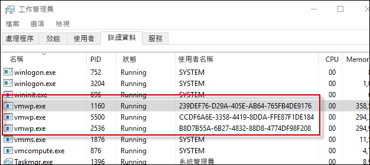

# Hyper-V 容器

**這是初版內容，後續可能會變更。**

Windows 容器技術包含兩種不同的類型的容器，即 Windows Server 容器和 Hyper-V 容器。 這兩種容器的建立、管理和運作方式都相同。 兩者的差異在於，在容器、主機作業系統，以及所有在該主機上執行的其他容器之間建立的隔離層級。

**Windows Server 容器** – 多個容器在一個主機上執行，透過命名空間和處理隔離技術來提供隔離功能。

**Hyper-V 容器** – 多個容器在一個主機上執行，但每個容器皆執行於公用程式虛擬機器之中。 這可在 Hyper-V 容器、容器主機和任何其他在容器主機上執行的容器之間提供核心層級隔離。

## Hyper-V 容器 PowerShell

### 建立容器

Hyper-V 容器的建立方式與 Widows Server 容器十分類似，唯一的差別是會以執行階段參數指出它是 Hyper-V 容器。

使用 PowerShell 建立 Hyper-V 容器的範例

```powershell
PS C:\> $con = New-Container -Name HYPVCON -ContainerImageName NanoServer -SwitchName "Virtual Switch" -RuntimeType HyperV
```

### 轉換容器

除了在建置階段將容器建立為 Hyper-V 容器以外，使用 PowerShell 建立的容器也可從 Windows Server 容器轉換為 Hyper-V 容器。

> 目前，唯一支援容器執行階段轉換的主機作業系統是 Nano Server。

使用預設執行階段建立新容器。

```powershell
PS C:\> New-Container -Name DEMO -ContainerImageName nanoserver -SwitchName NAT
```
從容器傳回執行階段屬性，請注意，執行階段會設定為預設值。

```powershell
PS C:\> Get-Container | Select ContainerName, RuntimeType

ContainerName RuntimeType
------------- -----------
DEMO              Default
```

使用 `set-container` 命令來變更容器執行階段。

```powershell
PS C:\> Set-Container $con -RuntimeType HyperV
```

最後，再次傳回執行階段屬性，以檢視變更。

```powershell
PS C:\> Get-Container | select ContainerName, RuntimeType

ContainerName RuntimeType
------------- -----------
DEMO               HyperV
```

## Hyper-V 容器 Docker

### 建立容器

使用 Docker 管理 Hyper-V 容器的方式，與管理 Windows Server 容器幾乎完全相同。 使用 Docker 建立 Hyper-V 容器時，會使用 `–issolation=hyperv` 參數。

```powershell
docker run -it --isolation=hyperv 646d6317b02f cmd
```

## 內部

### VM 背景工作程序

對於所建立的每個 Hyper-V 容器，都會建立對應的虛擬機器背景工作程序。

```powershell
PS C:\> Get-Container | Select Name, RuntimeType, ContainerID | Where {$_.RuntimeType -eq 'Hyperv'}

Name RuntimeType ContainerId
---- ----------- -----------
TST3      HyperV 239def76-d29a-405e-ab64-765fb4de9176
TST       HyperV b8d7b55a-6b27-4832-88d8-4774df98f208
TST2      HyperV ccdf6a6e-3358-4419-8dda-ffe87f1de184
```

請注意，容器可藉由容器識別碼和程序使用者名稱與程序比對。



也可以使用 `Get-ComputeProcess` 命令來檢視此關聯性。

```powershell
PS C:\> Get-ComputeProcess

Id                                   Name Owner      Type
--                                   ---- -----      ----
239DEF76-D29A-405E-AB64-765FB4DE9176 TST3 VMMS  Container
B8D7B55A-6B27-4832-88D8-4774DF98F208 TST  VMMS  Container
CCDF6A6E-3358-4419-8DDA-FFE87F1DE184 TST2 VMMS  Container
```

如需 `Get-ComputeProcess` 命令的詳細資訊，請參閱[管理互通性](./hcs_powershell.md)。

## 隔離示範

### Windows Server 容器

下列練習可以用來示範 Hyper-V 容器的隔離。 在本練習中，將會同時建立 Windows Server 和 Hyper-V 容器。 容器主機上的執行中程序會受到檢查，也將會說明如何在容器主機上共用 Windows Server 容器程序；Hyper-V 容器程序則不會共用。

```powershell
PS C:\> get-process | where {$_.ProcessName -eq 'csrss'}

Handles  NPM(K)    PM(K)      WS(K) VM(M)   CPU(s)     Id  SI ProcessName
-------  ------    -----      ----- -----   ------     --  -- -----------
    255      12     1820       4000 ...98     0.53    532   0 csrss
    116      11     1284       3700 ...94     0.25    608   1 csrss
    246      13     1844       5504 ...17     3.45   3484   2 csrss
```

建立新的 Windows Server 容器：

```powershell
PS C:\> New-Container -Name WINCONT -ContainerImageName WindowsServerCore -SwitchName "Virtual Switch"
```

啟動容器：

```powershell
PS C:\> Start-Container $con
```

建立容器的遠端 PS 工作階段。

```powershell
PS C:\> Enter-PSSession -ContainerId $con.ContainerId –RunAsAdministrator
```

從遠端容器工作階段傳回程序名稱為 csrss 的所有程序。 記下執行中 csrss 程序的程序識別碼 (在下列範例中為 1228)。

```powershell
[WINCONT]: PS C:\> get-process | where {$_.ProcessName -eq 'csrss'}

Handles  NPM(K)    PM(K)      WS(K) VM(M)   CPU(s)     Id  SI ProcessName
-------  ------    -----      ----- -----   ------     --  -- -----------
    167       9     1276       3720 ...97     0.20   1228   3 csrss
```

現在，從容器主機傳回 csrss 程序清單。 請注意，從容器主機也會傳回相同的 csrss 程序。

```powershell
PS C:\> get-process | where {$_.ProcessName -eq 'csrss'}

Handles  NPM(K)    PM(K)      WS(K) VM(M)   CPU(s)     Id  SI ProcessName
-------  ------    -----      ----- -----   ------     --  -- -----------
    252      11     1712       3968 ...98     0.53    532   0 csrss
    113      11     1176       3676 ...93     0.25    608   1 csrss
    175       9     1260       3708 ...97     0.20   1228   3 csrss
    243      13     1736       5512 ...17     3.77   3484   2 csrss
```
### Hyper-V 容器

從容器主機傳回 csrss 程序清單。

```powershell
PS C:\> get-process | where {$_.ProcessName -eq 'csrss'}

Handles  NPM(K)    PM(K)      WS(K) VM(M)   CPU(s)     Id  SI ProcessName
-------  ------    -----      ----- -----   ------     --  -- -----------
    261      12     1820       4004 ...98     0.53    532   0 csrss
    116      11     1284       3704 ...94     0.25    608   1 csrss
    246      13     1844       5536 ...17     3.83   3484   2 csrss
```

現在，建立 Hyper-V 容器。

```powershell
PS C:\> $con = New-Container -Name HYPVCON -ContainerImageName NanoServer -SwitchName "Virtual Switch" -RuntimeType HyperV
```

啟動 Hyper-V 容器

```powershell
PS C:\> Start-Container $con
```

建立 Hyper-V 容器的遠端 PS 工作階段。

```powershell
PS C:\> Enter-PSSession -ContainerId $con.ContainerId –RunAsAdministrator
```

傳回在 Hyper-V 容器內執行之 csrss 程序的清單。 記下 csrss 程序的程序識別碼 (在下列範例中為 956)。

```powershell
[HYPVCON]: PS C:\> get-process | where {$_.ProcessName -eq 'csrss'}

Handles  NPM(K)    PM(K)      WS(K) VM(M)   CPU(s)     Id  SI ProcessName
-------  ------    -----      ----- -----   ------     --  -- -----------
              4      452       1520 ...63     0.06    956   1 csrss
```

現在，傳回容器主機上的 csrss 程序清單。 請注意，不同於 Windows Server 容器可從容器和容器主機來檢視 csrss 程序，Hyper-V 容器程序只能從容器本身來檢視。 這是因為 Hyper-V 容器封裝在公用程式虛擬機器中，而程序只隔離至該公用程式虛擬機器。

```powershell
PS C:\> get-process | where {$_.ProcessName -eq 'csrss'}

Handles  NPM(K)    PM(K)      WS(K) VM(M)   CPU(s)     Id  SI ProcessName
-------  ------    -----      ----- -----   ------     --  -- -----------
    255      12     1716       3972 ...98     0.56    532   0 csrss
    113      11     1176       3676 ...93     0.25    608   1 csrss
    243      13     1732       5512 ...18     4.23   3484   2 csrss
```


