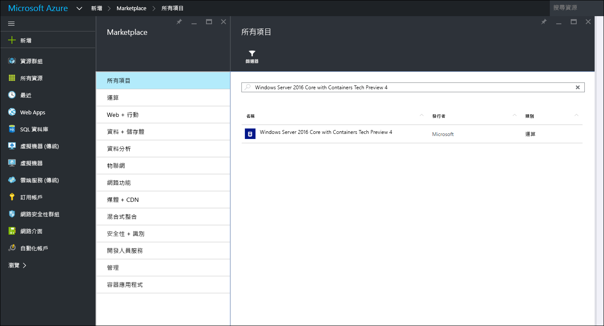
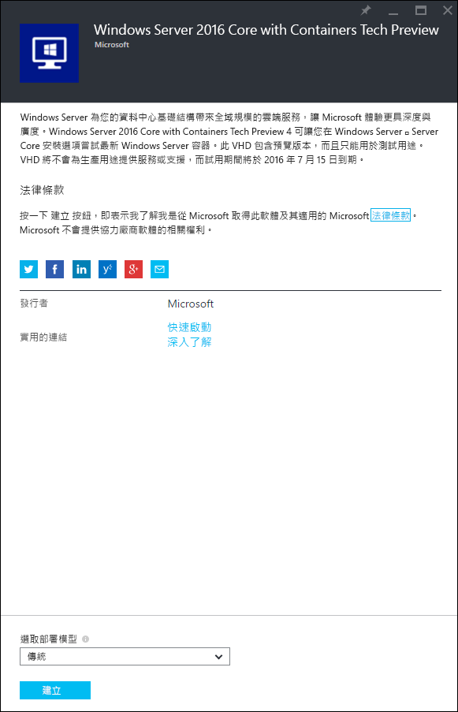
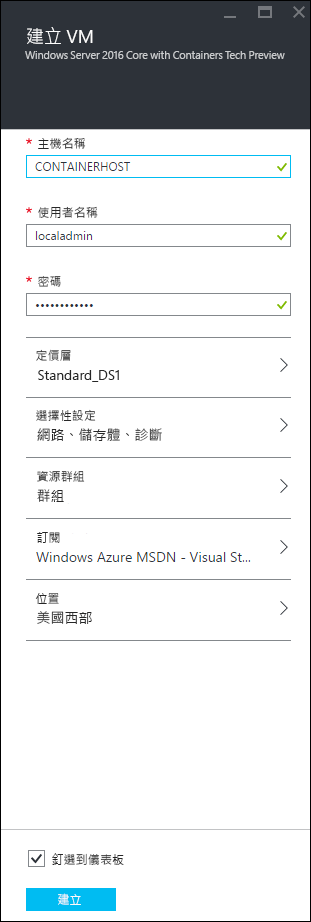
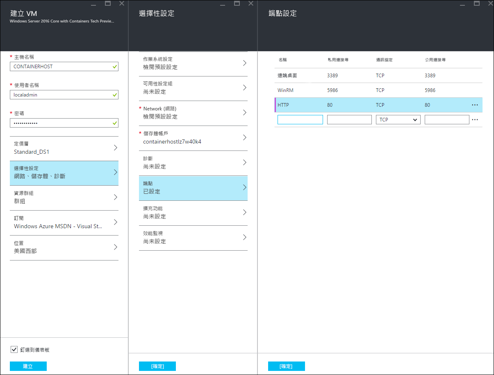
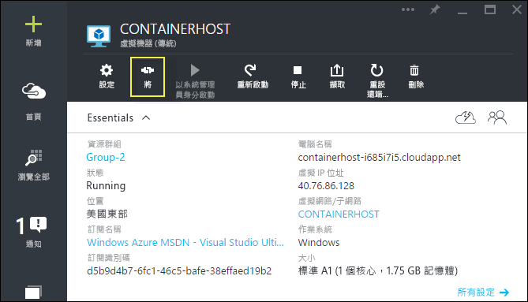
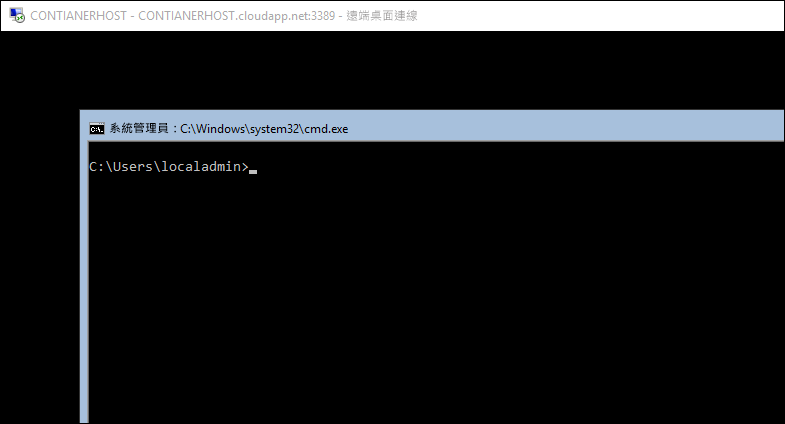

# Azure 快速入門

在 Azure 中建立及管理 Windows Server 容器之前，您必須部署已預先設定 Windows Server 容器功能的 Windows Server 2016 Technical Preview 映像。 本指南將逐步引導您完成此程序。

> Microsoft Azure 不支援 Hyper-V 容器。 若要完成 Hyper-V 容器練習，您必須要有內部部署容器主機。

## 開始使用 Azure 入口網站

如果您有 Azure 帳戶，請跳至[建立容器主機 VM](#CreateacontainerhostVM)。

1. 前往 [azure.com](https://azure.com)，並遵循 [Azure 免費試用](https://azure.microsoft.com/en-us/pricing/free-trial/)的步驟作業。
2. 使用您的 Microsoft 帳戶登入。
3. 帳戶準備就緒後，請登入 [Azure 管理入口網站](https://portal.azure.com)。

## 建立容器主機 VM

在 Azure Market Place 中搜尋 ‘containers’，這會傳回 ‘Windows Server 2016 Core with Containers Tech Preview 4’



選取映像，然後按一下 [建立]``。



提供虛擬機器名稱，選取使用者名稱和密碼。



選取 [選用設定] > [端點] >，並輸入具有私人和公用連接埠 80 的 HTTP 端點，如下所示。 完成之後，按兩次 [確定]。



選取 [建立]`` 按鈕，以啟動虛擬機器部署程序。


VM 部署完成後，請選取 [連接] 按鈕，以啟動 Windows Server 容器主機的 RDP 工作階段。



使用在 VM 建立精靈執行期間指定的使用者名稱和密碼來登入 VM。 登入之後，您會看見 Windows 命令提示字元。



## 更新 Docker 引擎

若要搭配 Azure Windows 容器技術預覽映像使用 `docker pull`，必須更新Docker 引擎。 請在 Azure 虛擬機器上執行下列 PowerShell 命令，以完成這項更新。

```powershell
PS C:\> wget https://raw.githubusercontent.com/Microsoft/Virtualization-Documentation/live/windows-server-container-tools/Update-ContainerHost/Update-ContainerHost.ps1 -OutFile Update-ContainerHost.ps1

PS C:\> ./Update-ContainerHost.ps1
```

## 視訊逐步解說

<iframe src="https://channel9.msdn.com/Blogs/containers/Quick-Start-Configure-Windows-Server-Containers-in-Microsoft-Azure/player#ccLang=zh-tw" width="800" height="450"  allowFullScreen="true" frameBorder="0" scrolling="no"></iframe>


## 後續步驟：開始使用容器

現在您已有執行 Windows Server 容器功能的 Windows Server 2016 系統，接下來請移至下列指南，開始使用 Windows Server 容器和 Windows Server 容器映像。

[快速入門：Windows 容器和 Docker](./manage_docker.md)  
[快速入門：Windows 容器和 PowerShell](./manage_powershell.md)


<!--HONumber=Mar16_HO3-->


