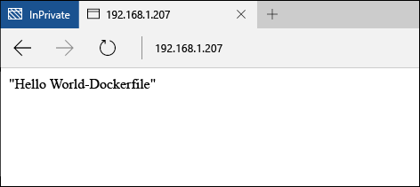

# Windows 容器快速入門 - Docker

Windows 容器可用來在單一電腦系統上快速部署許多隔離的應用程式。 此練習將示範如何使用 Docker 建立及管理 Windows 容器。 完成之後，您即應概略了解 Docker 與 Windows 容器的整合情形，且將獲得此技術的實務經驗。

此逐步解說將詳細說明 Windows Server 容器和 Hyper-V 容器。 這兩種容器都有其本身的基本需求。 Windows 容器文件包含快速部署容器主機的程序。 要快速開始使用 Windows 容器，這是最簡單的方式。 如果您還沒有容器主機，請參閱[容器主機部署快速入門](./container_setup.md)。

進行各項練習時，將需要下列項目。

**Windows Server 容器：**

- 執行 Windows Server 2016 (Full 或 Core) 的 Windows 容器主機，內部部署或在 Azure 中皆可。

**Hyper-V 容器：**

- 已啟用巢狀虛擬化的 Windows 容器主機。
- Windows Server 2016 媒體 - [下載](https://aka.ms/tp4/serveriso)。

>Microsoft Azure 不支援 Hyper-V 容器。 若要完成 Hyper-V 容器練習，您必須要有內部部署容器主機。

## Windows Server 容器

Windows Server 容器提供隔離、可攜式、由資源控制的作業環境，用以執行應用程式和主控程序。 Windows Server 容器提供透過程序和命名空間隔離來隔離容器與主機的功能。

### 建立容器

建立容器前，請使用 `docker images` 命令，列出主機上所安裝的容器映像。

```powershell
PS C:\> docker images

REPOSITORY          TAG                 IMAGE ID            CREATED             VIRTUAL SIZE
windowsservercore   10.0.10586.0        6801d964fda5        2 weeks ago         0 B
windowsservercore   latest              6801d964fda5        2 weeks ago         0 B
nanoserver          10.0.10586.0        8572198a60f1        2 weeks ago         0 B
nanoserver          latest              8572198a60f1        2 weeks ago         0 B
```

在此範例中，請使用 Windows Server Core 映像建立容器。 這可藉由 `docker run` 命令來完成。 如需 `docker run` 的詳細資訊，請參閱 [docker.com 上的 Docker Run 參考](https://docs.docker.com/engine/reference/run/)。

此範例會建立名為 `iisbase` 的容器，並啟動容器的互動式工作階段。

```powershell
C:\> docker run --name iisbase -it windowsservercore cmd
```

容器建立後，您將會在來自該容器的殼層工作階段中工作。


### 建立 IIS 映像

將會安裝 IIS，然後從容器建立映像。 若要安裝 IIS，請執行下列命令。

```powershell
C:\> powershell.exe Install-WindowsFeature web-server
```

完成之後，請結束互動式殼層工作階段。

```powershell
C:\> exit
```

最後，將會使用 `docker commit` 將容器認可至新的容器映像。 此範例會建立名稱為 `windowsservercoreiis` 的新容器映像。

```powershell
C:\> docker commit iisbase windowsservercoreiis
4193c9f34e320c4e2c52ec52550df225b2243927ed21f014fbfff3f29474b090
```

可使用 `docker images` 命令來檢視新的 IIS 映像。

```powershell
C:\> docker images

REPOSITORY             TAG                 IMAGE ID            CREATED             VIRTUAL SIZE
windowsservercoreiis   latest              4193c9f34e32        4 minutes ago       170.8 MB
windowsservercore      10.0.10586.0        6801d964fda5        2 weeks ago         0 B
windowsservercore      latest              6801d964fda5        2 weeks ago         0 B
nanoserver             10.0.10586.0        8572198a60f1        2 weeks ago         0 B
nanoserver             latest              8572198a60f1        2 weeks ago         0 B
```

### 設定網路

在使用 Docker 建立容器之前，必須為 Windows 防火牆建立一個允許透過網路連接到容器的規則。 請執行下列命令，以建立連接埠 80 的規則。

```powershell
if (!(Get-NetFirewallRule | where {$_.Name -eq "TCP80"})) {
    New-NetFirewallRule -Name "TCP80" -DisplayName "HTTP on TCP/80" -Protocol tcp -LocalPort 80 -Action Allow -Enabled True
}
```

您也可以記下容器主機的 IP 位址。 這在整個練習中都會用到。

### 建立 IIS 容器

現在您已有包含 IIS 的容器映像，可用來部署 IIS 就緒的作業環境。

若要從新的映像建立容器，請使用 `docker run` 命令，但這次請指定 IIS 映像的名稱。 請注意，此範例指定了參數 `-p 80:80`。 由於容器連接到透過網路位址轉譯來提供 IP 位址的虛擬交換器，因此，必須將容器主機的一個連接埠對應至容器 NAT IP 位址的連接埠。 如需 `-p` 的詳細資訊，請參閱 [docker.com 上的 Docker Run 參考](https://docs.docker.com/engine/reference/run/)

```powershell
C:\> docker run --name iisdemo -it -p 80:80 windowsservercoreiis cmd
```

容器建立後，請開啟瀏覽器，然後瀏覽至容器主機的 IP 位址。 由於主機的連接埠 80 已對應至容器的連接埠 80，因此應會顯示 IIS 啟動顯示畫面。


### 建立應用程式

執行下列命令以移除 IIS 啟動顯示畫面。

```powershell
C:\> del C:\inetpub\wwwroot\iisstart.htm
```

執行下列命令，將預設 IIS 網站取代為新的靜態網站。

```powershell
C:\> echo "Hello World From a Windows Server Container" > C:\inetpub\wwwroot\index.html
```

再次瀏覽至容器主機的 IP 位址，此時您應會看見 ‘Hello World’ 應用程式。 注意：您可能必須關閉任何現有的瀏覽器連線，或清除瀏覽器快取，才能看見更新的應用程式。


結束容器的互動式工作階段。

```powershell
C:\> exit
```

移除容器

```powershell
C:\> docker rm iisdemo
```
移除 IIS 映像。

```powershell
C:\> docker rmi windowsservercoreiis
```

## Dockerfile

透過最後一項練習，容器已手動建立、修改，然後擷取至新的容器映像中。 Docker 含有將此程序自動化的方法，使用的是名為 dockerfile 的檔案。 此練習最後將有相同的結果，但這一次程序將會自動完成。

### 建立 IIS 映像

在容器主機上建立目錄 `c:\build`，然後在此目錄中建立名為 `dockerfile` 的檔案。

```powershell
C:\> powershell new-item c:\build\dockerfile -Force
```

在記事本中開啟 dockerfile。

```powershell
C:\> notepad c:\build\dockerfile
```

將下列文字複製到 dockerfile 中，並儲存檔案。 這些命令會指示 Docker 以 `windowsservercore` 做為基底建立新映像，並納入以 `RUN` 指定的修改。 如需 Dockerfile 的詳細資訊，請參閱 [docker.com 上的 Dockerfile 參考](http://docs.docker.com/engine/reference/builder/)。

```powershell
FROM windowsservercore
RUN dism /online /enable-feature /all /featurename:iis-webserver /NoRestart
RUN echo "Hello World - Dockerfile" > c:\inetpub\wwwroot\index.html
```

此命令將會啟動自動化映像建置程序。 `-t` 參數會指示程序將新映像命名為 `iis`。

```powershell
C:\> docker build -t iis c:\Build
```

完成之後，您可以使用 `docker images` 命令來證實映像是否已建立。

```powershell
C:\> docker images

REPOSITORY          TAG                 IMAGE ID            CREATED             VIRTUAL SIZE
iis                 latest              abb93867b6f4        26 seconds ago      209 MB
windowsservercore   10.0.10586.0        6801d964fda5        2 weeks ago         0 B
windowsservercore   latest              6801d964fda5        2 weeks ago         0 B
nanoserver          10.0.10586.0        8572198a60f1        2 weeks ago         0 B
nanoserver          latest              8572198a60f1        2 weeks ago         0 B
```

### 部署 IIS 容器

現在，就像在最後一個練習中一樣，請部署容器，將主機的連接埠 80 對應至容器的連接埠 80。

```powershell
C:\> docker run --name iisdemo -it -p 80:80 iis cmd
```

在容器建立後，請瀏覽至容器主機的 IP 位址。 您應會看見 hello world 應用程式。



結束容器的互動式工作階段。

```powershell
C:\> exit
```

移除容器

```powershell
C:\> docker rm iisdemo
```
移除 IIS 映像。

```powershell
C:\> docker rmi iis
```

## Hyper-V 容器

Hyper-V 容器可提供比 Windows Server 容器更深層的隔離。 每個 Hyper-V 容器都是在高度最佳化的虛擬機器內建立的。 在 Windows Server 容器與容器主機共用核心的環境中，Hyper-V 容器是完全隔離的。 Hyper-V 容器的建立和管理方式與 Windows Server 容器完全相同。 如需 Hyper-V 容器的詳細資訊，請參閱[管理 Hyper-V 容器](../management/hyperv_container.md)。

>Microsoft Azure 不支援 Hyper-V 容器。 若要完成 Hyper-V 練習，您必須要有內部部署容器主機。

### 建立容器

由於容器將會執行 Nano Server OS 映像，因此必須要有 Nano Server IIS 封裝，才能安裝 IIS。 這些項目可在 Windows Sever 2016 TP4 安裝媒體中找到，位於 `NanoServer\Packages` 目錄下。

在此範例中，會使用 `docker run` 的 `-v` 參數，使容器主機中的一個目錄可供執行中的容器使用。 在進行此作業前，必須先設定來源目錄。

請在容器主機上建立將與容器共用的目錄。 如果您已完成 PowerShell 逐步解說中，此目錄和所需的檔案可能已存在。

```powershell
C:\> powershell New-Item -Type Directory c:\share\en-us
```

將 `Microsoft-NanoServer-IIS-Package.cab` 從 `NanoServer\Packages` 複製到容器主機上的 `c:\share`。

將 `NanoServer\Packages\en-us\Microsoft-NanoServer-IIS-Package.cab` 複製到容器主機上的 `c:\share\en-us`。

在 c:\share 資料夾中建立名為 unattend.xml 的檔案，並將此文字複製到 unattend.xml 檔案中。

```powershell
<?xml version="1.0" encoding="utf-8"?>
<unattend xmlns="urn:schemas-microsoft-com:unattend">
    <servicing>
        <package action="install">
            <assemblyIdentity name="Microsoft-NanoServer-IIS-Package" version="10.0.10586.0" processorArchitecture="amd64" publicKeyToken="31bf3856ad364e35" language="neutral" />
            <source location="c:\iisinstall\Microsoft-NanoServer-IIS-Package.cab" />
        </package>
        <package action="install">
            <assemblyIdentity name="Microsoft-NanoServer-IIS-Package" version="10.0.10586.0" processorArchitecture="amd64" publicKeyToken="31bf3856ad364e35" language="en-US" />
            <source location="c:\iisinstall\en-us\Microsoft-NanoServer-IIS-Package.cab" />
        </package>
    </servicing>
</unattend>
```

完成之後，容器主機上的 `c:\share` 目錄應設定如下。

```
c:\share
|-- en-us
|    |-- Microsoft-NanoServer-IIS-Package.cab
|
|-- Microsoft-NanoServer-IIS-Package.cab
|-- unattend.xml
```

若要使用 docker 建立 Hyper-V 容器，請指定 `--isolation=hyperv` 參數。 此範例會將主機的 `c:\share` 目錄裝載到容器的 `c:\iisinstall` 目錄，然後建立容器的互動式殼層工作階段。

```powershell
C:\> docker run --name iisnanobase -it -v c:\share:c:\iisinstall --isolation=hyperv nanoserver cmd
```

### 建立 IIS 映像

從容器殼層工作階段中，可以使用 `dism` 來安裝 IIS。 執行下列命令，以在容器中安裝 IIS。

```powershell
C:\> dism /online /apply-unattend:c:\iisinstall\unattend.xml
```

IIS 安裝完成後，請使用下列命令手動啟動 IIS。

```powershell
C:\> Net start w3svc
```

結束容器工作階段。

```powershell
C:\> exit
```

### 建立 IIS 容器

修改過的 Nano Server 容器現在可以認可至新的容器映像。 若要這樣做，請使用 `docker commit` 命令。

```powershell
C:\> docker commit iisnanobase nanoserveriis
```

傳回容器映像清單時可看到下列結果。

```powershell
C:\> docker images

REPOSITORY          TAG                 IMAGE ID            CREATED              VIRTUAL SIZE
nanoserveriis       latest              444435a4e30f        About a minute ago   69.14 MB
windowsservercore   10.0.10586.0        6801d964fda5        2 weeks ago          0 B
windowsservercore   latest              6801d964fda5        2 weeks ago          0 B
nanoserver          10.0.10586.0        8572198a60f1        2 weeks ago          0 B
nanoserver          latest              8572198a60f1        2 weeks ago          0 B
```

### 建立應用程式

Nano Server IIS 映像現在已可部署至新的容器。

```powershell
C:\> docker run -it -p 80:80 --isolation=hyperv nanoserveriis cmd
```

執行下列命令以移除 IIS 啟動顯示畫面。

```powershell
C:\> del C:\inetpub\wwwroot\iisstart.htm
```

執行下列命令，將預設 IIS 網站取代為新的靜態網站。

```powershell
C:\> echo "Hello World From a Hyper-V Container" > C:\inetpub\wwwroot\index.html
```

瀏覽至容器主機的 IP 位址，您現在應該會看到 ’Hello World’ 應用程式。 注意：您可能必須關閉任何現有的瀏覽器連線，或清除瀏覽器快取，才能看見更新的應用程式。


結束容器的互動式工作階段。

```powershell
C:\> exit
```


<!--HONumber=Jan16_HO1-->
