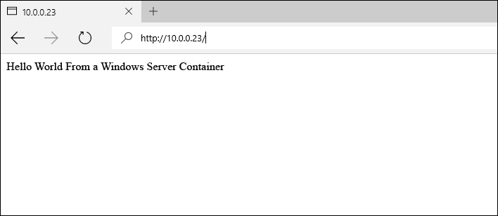

# Windows Server 上的容器映像

**這是初版內容，後續可能會變更。** 

在先前的 Windows Server 快速入門中，已從預先存在的容器映像建立 Windows 容器。 這個練習會詳細說明手動建立自訂容器映像及使用 Dockerfile 的方式。

本快速入門是針對 Windows Server 2016 上的 Windows Server 容器。 在此頁面左側的目錄中，可以找到其他的快速入門文件。 

**必要條件：**

- 一個執行 [Windows Server 2016 Technical Preview 5](https://www.microsoft.com/en-us/evalcenter/evaluate-windows-server-technical-preview) 的電腦系統 (實體或虛擬)。
- 設定此系統的 Windows 容器功能和 Docker。 如需這些步驟的逐步解說，請參閱 [Windows Server 上的 Windows 容器](./quick_start_windows_server.md)。

## 1.容器映像 - 手動

如欲得到最佳的體驗，請從 Windows 命令殼層 (cmd.exe) 逐步進行本練習。

手動建立容器映像的第一個步驟是部署容器。 針對此範例，請從預先建立的 IIS 映像部署 IIS 容器。 部署容器後，您將會在來自該容器的殼層工作階段中工作。 互動式工作階段會以 `-it` 旗標起始。 如需 Docker Run 命令的深入詳細資訊，請參閱 [Docker.com 上的 Docker Run Reference]( https://docs.docker.com/engine/reference/run/)。 

```none
docker run -it -p 80:80 microsoft/iis:windowsservercore cmd
```

接下來，將會修改容器。 執行下列命令以移除 IIS 啟動顯示畫面。

```none
del C:\inetpub\wwwroot\iisstart.htm
```

並且執行下列命令，將預設 IIS 網站取代為新的靜態網站。

```none
echo "Hello World From a Windows Server Container" > C:\inetpub\wwwroot\index.html
```

從不同的系統中，瀏覽至容器主機的 IP 位址。 現在您應會看見 ‘Hello World’ 應用程式。

**注意︰** 如果您正在使用 Azure，必須有允許流量通過連接埠 80 的網路安全性群組規則。 如需詳細資訊，請參閱[建立現有 NSG 中的規則]( https://azure.microsoft.com/en-us/documentation/articles/virtual-networks-create-nsg-arm-pportal/#create-rules-in-an-existing-nsg)。



回到容器中，結束互動式容器工作階段。

```none
exit
```

修改過的容器現在可以擷取至新的容器映像。 若要這樣做，您必須使用容器名稱。 使用 `docker ps -a` 命令即可找到。

```none
docker ps -a

CONTAINER ID     IMAGE                             COMMAND   CREATED             STATUS   PORTS   NAMES
489b0b447949     microsoft/iis:windowsservercore   "cmd"     About an hour ago   Exited           pedantic_lichterman
```

若要建立新容器映像，請使用 `docker commit` 命令。 Docker commit 的形式為 “docker commit 容器名稱 新映像名稱”。 請注意，請將此範例中的容器名稱取代為實際的容器名稱。

```none
docker commit pedantic_lichterman modified-iis
```

若要確認已建立新映像，請使用 `docker images` 命令。  

```none
docker images

REPOSITORY          TAG                 IMAGE ID            CREATED              SIZE
modified-iis        latest              3e4fdb6ed3bc        About a minute ago   10.17 GB
microsoft/iis       windowsservercore   c26f4ceb81db        2 weeks ago          9.48 GB
windowsservercore   10.0.14300.1000     dbfee88ee9fd        8 weeks ago          9.344 GB
windowsservercore   latest              dbfee88ee9fd        8 weeks ago          9.344 GB
```

現在可以部署此映像。 產生的容器將包含所有擷取的修改。

## 2.容器映像 - Dockerfile

透過最後一項練習，容器已手動建立、修改，然後擷取至新的容器映像中。 Docker 含有將此程序自動化的方法，其使用稱為 Dockerfile 的檔案。 此練習最後將有幾乎相同的結果，但這一次程序將會自動進行。

在容器主機上建立目錄 `c:\build`，然後在此目錄中建立名為 `Dockerfile` 的檔案。 請注意 – 檔案不應該具有副檔名。

```none
powershell new-item c:\build\Dockerfile -Force
```

在記事本中開啟 Dockerfile。

```none
notepad c:\build\Dockerfile
```

將下列文字複製到 Dockerfile 中，並儲存檔案。 這些命令會指示 Docker 建立新的映像，並且使用 `microsoft/iis` 作為基礎。 Dockerfile 接著會執行 `RUN` 指示中指定的命令，在此情況下，index.html 檔案會更新為新內容。 

如需 Dockerfile 的詳細資訊，請參閱 [Windows 上的 Dockerfile](../docker/manage_windows_dockerfile.md)。

```none
FROM microsoft/iis:windowsservercore
RUN echo "Hello World - Dockerfile" > c:\inetpub\wwwroot\index.html
```

`docker build` 命令將會啟動映像建置程序。 `-t` 參數會指示建置程序將新映像命名為 `iis-dockerfile`。

```none
docker build -t iis-dockerfile c:\Build
```

完成之後，您可以使用 `docker images` 命令來驗證映像是否已建立。

```none
docker images

REPOSITORY          TAG                 IMAGE ID            CREATED             SIZE
iis-dockerfile      latest              8d1ab4e7e48e        2 seconds ago       9.483 GB
microsoft/iis       windowsservercore   c26f4ceb81db        2 weeks ago         9.48 GB
windowsservercore   10.0.14300.1000     dbfee88ee9fd        8 weeks ago         9.344 GB
windowsservercore   latest              dbfee88ee9fd        8 weeks ago         9.344 GB
```

現在，請使用下列命令部署容器。 

```none
docker run -d -p 80:80 iis-dockerfile ping -t localhost
```

在容器建立後，請瀏覽至容器主機的 IP 位址。 您應會看見 hello world 應用程式。


回到容器主機上，使用 `docker ps` 以取得容器的名稱，使用 `docker rm` 則可移除容器。 請注意，請將此範例中的容器名稱取代為實際的容器名稱。

取得容器名稱。

```none
docker ps

CONTAINER ID   IMAGE            COMMAND               CREATED              STATUS              PORTS                NAMES
c1dc6c1387b9   iis-dockerfile   "ping -t localhost"   About a minute ago   Up About a minute   0.0.0.0:80->80/tcp   cranky_brown
```

移除容器。

```none
docker rm -f cranky_brown
```

## 後續步驟

[Windows 10 上的 Windows 容器](./quick_start_windows_10.md)


<!--HONumber=Jun16_HO5-->


